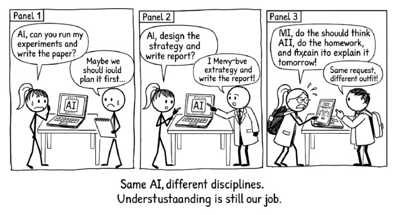

# A Conversation Across Disciplines {#sec-across-disciplines}

{fig-alt="Comic strip: Different professionals (scientist, strategist, student) all use the same AI. Same request, different contexts. Punchline: Same AI, different disciplines. Understanding is still our job."}

> The method does not change when the discipline does. Only the examples change.

The tools are in place. You know the Conversation Loop (@sec-conversation-loop). You know how to start well with RTCF (@sec-rtcf). You know how to push back with VET (@sec-vet). You know how to chain prompts into a sustained line of thinking (@sec-prompt-chaining).

Now let's see it work.

This chapter walks through four complete examples across four different domains. Each one follows a realistic starting point through a real conversation to a result the human owns. None of them are transcripts. They are summaries of what happened, with the key steering decisions called out.

Pay attention to those steering decisions. They are the difference between conversation and delegation. They are always human. They are always specific. And they always make the output better than the AI would have produced alone.

> The human brought something the AI could not. The AI brought something the human could not match. Neither was sufficient alone.

## Writing and Research: Building an Argument That Holds Up

**The situation.** A postgraduate student is writing a 3,000-word essay on whether social media regulation should follow the tobacco precedent. She has a position but no structure. Her reading list is long and unsorted. She has three days.

**The conversation.** She opens with RTCF: role (academic writing advisor familiar with media regulation), task (help me organise my argument), context (essay question, word limit, three sources she has already read), format (an outline with a thesis statement and three supporting claims).

The AI returns a clean five-section outline. It is competent and entirely predictable. This is the **Brainstorm** stage, and it has done its job: given her something concrete to react to.

She reacts. "The third section is too broad. I don't want to argue that all regulation works. I want to argue that the specific mechanism of restricting advertising to minors is transferable." This is the steering decision that matters. The AI did not know her argument. She does.

They move into **Ideate**. She asks the AI to suggest three counterarguments to her revised thesis. Two are useful. One is a straw man. She tells it so, and asks for a stronger version. The replacement is genuinely challenging. She had not considered the platform liability angle.

Now she chains prompts (@sec-prompt-chaining) through the **Iterate** stage. For each section, she pastes her rough notes and asks the AI to identify gaps in her evidence. She runs VET on the citations it suggests: two check out, one is a real paper with a fabricated finding. She drops it and finds a better source herself.

In the **Amplify** stage, she writes the essay. Not the AI. She writes it, using the structure they built together and the sharpened argument that emerged from iteration.

**What made this conversation, not delegation.** She brought her own position and sharpened it through pushback. She caught a fabricated citation because she verified rather than trusted. The AI never wrote a sentence of the essay. It helped her think about what to write.

## Data and Analysis: Making Sense of Results That Don't Cooperate

**The situation.** A market analyst has just pulled quarterly sales figures for six product lines across four regions. Two regions are up. Two are flat. But the product-level numbers tell a different story, and the patterns are not obvious. Her manager wants a narrative for the board by Friday.

**The conversation.** She starts at **Brainstorm** with RTCF: role (data analyst experienced in retail trends), task (help me identify the most important patterns in this data), context (she pastes a summary table of the figures with year-on-year changes), format (a ranked list of the three most significant findings).

The AI identifies three patterns. The first is obvious: she already knew Region A was up. The second is interesting: a product line growing in flat markets, suggesting it is taking share rather than riding a rising tide. The third is wrong. It claims Region D is declining, but the flat number masks a seasonal effect she knows about from experience.

She corrects the AI and tells it why the seasonality matters. This is the steering decision. She is the one who knows the business. The AI is the one scanning for patterns. Neither could do this alone.

In the **Ideate** stage, she asks the AI to generate three possible explanations for the share-taking pattern. One involves pricing. One involves channel mix. One involves a competitor withdrawal she happens to know is true but had not connected to this data. Now she has a hypothesis worth testing.

She moves to **Iterate** by chaining prompts. She feeds in additional context, asks the AI to stress-test the competitor-withdrawal explanation, and applies VET: can she verify the timeline? Does the explanation hold across all four regions, or only where the competitor was strong? The AI helps her find the edge case. The pattern holds in three regions, not four. She adjusts the narrative accordingly.

In the **Amplify** stage, she builds her board summary around the refined finding, with appropriate caveats. The insight is hers. The AI helped her find it faster than she would have alone.

**What made this conversation, not delegation.** She corrected the AI's misread of her data because she knew the seasonal context. She tested the hypothesis against edge cases before presenting it. The board narrative is grounded in her judgement, not in the AI's first pass.

## Planning and Decision-Making: Scoping a Project Without Fooling Yourself

**The situation.** A team lead has been asked to propose a plan for migrating his department's client records from a legacy system to a new platform. He knows the destination system. He does not know how to estimate the effort, and his last migration project ran 40% over time.

**The conversation.** He opens at the **Brainstorm** stage using RTCF: role (experienced project manager who has run data migration projects), task (help me build a realistic project scope), context (number of records, source and destination systems, team size of four, no dedicated data engineer), format (a phased project plan with risk flags).

The AI produces a four-phase plan: discovery, mapping, migration, validation. It is textbook. It is also the plan he ran last time, the one that went over. He says so. "This looks like every migration plan ever written. What specifically goes wrong in phase two when you don't have a dedicated data engineer?"

This prompt, a direct challenge born from experience, is the steering decision that transforms the conversation. The AI responds with five specific risks around data mapping when domain expertise is split across team members. Two of them match what went wrong last time.

In the **Ideate** stage, he asks the AI to propose three ways to mitigate the mapping bottleneck without hiring. The options range from automated schema comparison tools to a dedicated mapping sprint before the main project starts. He knows option three is realistic for his team. The others require tools they don't have budget for.

He moves to **Iterate** with prompt chaining. He takes the mapping sprint idea and asks the AI to help him estimate effort for each phase, then applies VET: do the estimates assume full-time allocation? (They do. His team is not full-time on this.) He corrects the assumption and the AI recalculates. The project timeline grows by three weeks, but now it is honest.

In the **Amplify** stage, he writes the proposal with the revised timeline, the explicit risk register, and the mapping sprint as a pre-phase. He flags the three-week extension to his manager before it becomes a surprise.

**What made this conversation, not delegation.** He rejected the generic plan because he had lived through its failure. He forced the AI to address his specific constraint. The resulting plan is more realistic because he insisted on honest assumptions rather than accepting optimistic defaults.

## Professional Communication: Getting the Tone Right When the Stakes Are High

**The situation.** A department head needs to email her team about a restructure. Two roles are being eliminated. Three people are moving to new teams. Everyone else stays, but morale is fragile. She needs to be honest without being brutal, and reassuring without being dishonest.

**The conversation.** She starts at the **Brainstorm** stage with RTCF: role (communications advisor experienced in organisational change), task (help me draft an internal email announcing a team restructure), context (she outlines the changes, the reasons, and the emotional state of the team), format (professional email, 300 words, direct but empathetic).

The AI's first draft is polished and empty. It reads like every corporate restructure email ever sent. "We are excited about the opportunities ahead." She is not excited, and neither is her team. She tells the AI: "Remove anything that sounds like it came from a press release. These people will read this email looking for whether they can still trust me. Write for that audience."

This is the steering decision. She knows her audience in a way no prompt can fully convey. The AI can adjust tone, but only she can tell it which tone is right.

In the **Ideate** stage, she asks the AI to produce three different opening lines: one that leads with the facts, one that leads with acknowledgement of difficulty, one that leads with the reason for the change. She picks the second and asks the AI to develop it.

She moves to **Iterate** by reading each paragraph aloud. Two sound right. One is still too corporate. She rewrites that paragraph herself and asks the AI to check whether the overall message is internally consistent: does the tone of the opening match the tone of the close? The AI spots a disconnect. The opening is empathetic, but the closing pivots to optimism too quickly. She adjusts.

She applies VET to the factual claims in the email. Are the timelines accurate? Has she described the support available to affected staff correctly? She checks with HR before sending.

In the **Amplify** stage, she sends the email in her voice, with her name on it, confident that every word reflects what she actually means.

**What made this conversation, not delegation.** She rejected the AI's first draft entirely because she knew what her team needed to hear. She wrote the hardest paragraph herself. The email went out as hers because she made it hers, not because the AI wrote something she happened to agree with.

## The Pattern Across All Four

Look at what stayed constant.

The human brought something the AI could not: a position, domain knowledge, a lived constraint, an understanding of audience. The AI brought something the human could not match: speed across alternatives, tireless iteration, the ability to generate options without ego.

Every example used the Conversation Loop. Every one involved a moment where the human rejected or redirected the AI's output based on something only they knew. Every one ended with an output the human could put their name on and defend.

::: {.callout-note title="The pattern"}
In every example, the turning point was a moment where the human rejected or redirected the AI's output based on something only they knew. That is the method. Not a formula. A way of working.
:::

Notice how each example naturally separates thinking from building. The student explored her argument before writing the essay. The analyst tested her hypothesis before presenting to the board. The team lead challenged the generic plan before proposing his own. The department head rejected the corporate tone before sending the email. In each case, the thinking and the building were distinct phases, and the human was the bridge between them. This is the two-chat workflow (@sec-two-chat-workflow) in action, whether or not the person literally used two sessions.
