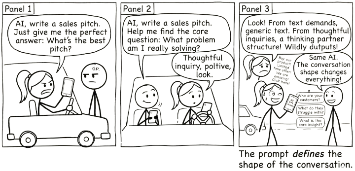
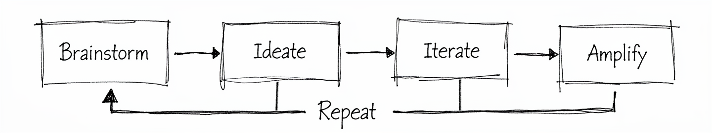

# The Conversation Loop {#sec-conversation-loop}

{fig-alt="Comic strip: One stick figure demands 'give me the perfect answer' and gets generic text. Another asks 'help me find the core question' and gets thoughtful, specific output. Same AI. The conversation shape changes everything."}

> A single prompt gets you an answer. A conversation gets you understanding.

You now know what AI is and what it is not. You know that large language models are fluent without being truthful, and capable without being experienced. You know the trap: delegation feels productive but erodes your capability over time. And you know that the protective practice is conversation, not delegation.

The question becomes: what does that conversation actually look like?

This is the model. Not a framework with twelve steps and a certification programme. A loop with four stages and one rule: you stay in the conversation.

{#fig-conversation-loop fig-alt="Hand-drawn diagram showing four boxes (Brainstorm, Ideate, Iterate, Amplify) connected by arrows flowing left to right, with a Repeat arrow looping back from Amplify to Brainstorm."}

Four stages. One feedback arc. Most good work passes through the loop more than once. That is the whole picture. Now let's walk through it.

> A good conversation with AI does not end with a better output. It ends with a better question.

## Brainstorm: Define Your Question

You arrive with a question, a problem, or a half-formed idea. Not a task to outsource. Not a prompt engineered to extract a finished deliverable in one shot. You bring something you are genuinely thinking about.

This matters more than it sounds. The quality of what comes out of the loop is bounded by what you bring into it. A vague "write me a strategy document" produces vague strategy. A specific "I'm stuck on how to position this product for buyers who already use a competitor" gives the conversation something to grip.

You do not need a polished brief. You need a real starting point: a question worth exploring.

Watch for a common trap: arriving with your attempted solution instead of your actual problem. Someone asks the AI "how do I make this spreadsheet sort by colour?" when their real question is "how do I show my team which tasks are overdue?" The AI will helpfully solve the spreadsheet problem. But the spreadsheet was never the point. A chart, a dashboard, or a simple filtered list might have been a better answer to the question they never asked.

This happens constantly. You get stuck, you start down a path, and by the time you reach for AI you have already framed the problem as your solution. The AI cannot know you are asking the wrong question. It will answer the one you gave it.

The fix is simple. Before you prompt, ask yourself: am I describing my problem, or am I describing my attempted fix? If it is the fix, step back one level. State the problem. Let the conversation find the solution.

## Ideate: Explore Possibilities

Brainstorm gave you a clear question. Ideate is where you and the AI go wide. This stage is generative and divergent. You are not looking for the answer. You are looking for more angles, adjacent ideas, framings you had not considered.

Ask for alternatives. Ask for the version that would make your sceptical colleague pause. Ask what you might be missing. The AI's breadth across domains is genuinely useful here, not because it knows your context better than you do, but because it can surface patterns and connections faster than you can scan for them alone.

The temptation is to stop here, take the first interesting output, and move on. Resist that. Ideation is cheap. The next stage is where value gets made.

## Iterate: Push Back and Refine

This is where conversation happens and where delegation is most tempting. You push back. You refine. You redirect.

"That second option is closer, but it assumes we have six months. We have six weeks."

"The tone is wrong. Less corporate, more direct."

"You're solving the wrong problem. The real constraint is budget, not timeline."

Every one of those responses sharpens the output. Every one requires your judgement. If you skip this stage, you are copying, not thinking. If you delegate here, you get something that is fluent, plausible, and not quite right in ways you will only notice later.

Iteration is work. It is also the stage that makes the output yours. Stay in it longer than feels necessary.

## Amplify: Make It Yours

You take the best of what emerged and make it yours. You edit, restructure, combine, cut. You bring it into your voice, your context, your standards.

Amplification is not "copy and paste with minor tweaks." It is the act of owning the output. You know things the AI does not: your audience, your constraints, the political dynamics of the room you will present in, the history behind the decision. This is where all of that knowledge gets folded in.

The result should be something you would put your name on without hesitation. If it is not, you are not done.

## Repeat: Go Around Again

Most good work loops more than once. The first pass through gives you a draft, a direction, a clearer version of your own thinking. The second pass sharpens it. The third might transform it entirely.

Knowing when to re-enter the loop is a skill. Sometimes you amplify and realise the framing is wrong, so you loop back to brainstorm with a better question. Sometimes iteration reveals a gap, so you return to ideation. The loop is not linear. The arrows point forward, but the feedback arc is always available.

The sign that you are done is not that the AI has stopped producing output. It is that your thinking has landed somewhere solid.

## You Do Not Need the Best Model

There is a common assumption that better AI models produce better results. For lookup tasks, where you need a precise fact, an accurate citation, or a verified figure, this is largely true. A more capable model is more likely to get it right.

But most of the work this book describes is not lookup work. It is thinking work: analysing a situation, weighing options, constructing an argument, identifying what you have missed. For thinking work, you do not need the AI to be right. You need it to be generative enough to be worth arguing with.

A smaller model that surfaces three plausible but imperfect framings of a problem, challenged and refined through genuine conversation, may produce better thinking than a frontier model (the most advanced available) that delivers one polished answer you accept without question.

This is not a hypothetical. It is what the conversation loop is designed to do. When you iterate, push back, and refine, you are compensating for whatever the model gets wrong. The friction of correcting an imperfect response is not a cost. It is the mechanism through which your own thinking sharpens. A "worse" model that forces you to think harder may serve you better than a "better" model that makes acceptance too easy.

There is a real danger on the other end. The more fluent and confident a model sounds, the harder its errors are to detect. A frontier model that gets something subtly wrong can leave you holding a plausible, well-written, and incorrect conclusion that you absorbed without the friction that would have revealed its flaws. Uncritical acceptance of a capable model's output can produce worse outcomes than no AI assistance at all.

The practical implication is freeing. You do not need the most expensive subscription to get value from this approach. Any general-purpose language model, free or paid, is sufficient for the kind of conversational work described in this book. What matters is not which model you use. It is whether you stay in the conversation.

## Why Conversation Scales

There is a reason we listen to podcasts, watch interviews, and find panel discussions more engaging than monologues. Conversation reveals things that prepared statements do not. When someone pushes back, follows up, or asks "why?", the thinking deepens. Ideas get tested in real time. Gaps surface. What survives the exchange is stronger than what either party brought in alone.

Universities have known this for centuries. The viva, an oral examination where a student defends their work in conversation with an examiner, remains the gold standard for assessing genuine understanding. You cannot bluff a viva. The examiner asks you to explain your reasoning, challenges your assumptions, changes the variables, and watches whether your understanding holds up or falls apart. Written exams test recall. Vivas test comprehension. The difference is the conversation.

This is why universities are returning to vivas and oral assessments in the age of AI. When a student can submit AI-generated written work that is indistinguishable from their own, the conversation becomes the one assessment that still reveals whether real learning occurred. The examiner is the human in the loop.

The conversation loop in this book works on exactly the same principle. When you iterate with AI, pushing back, asking "why?", testing edge cases, and demanding explanations, you are conducting a viva on the AI's output. You are the examiner. The AI's responses reveal whether the reasoning holds up or falls apart under scrutiny, and the process of examining it deepens your own understanding.

The difference is that vivas do not scale. One examiner, one student, thirty minutes. But conversations with AI scale infinitely. You get the benefits of viva-style engagement (the pushback, the "explain that differently," the "what if I changed this constraint?") any time you want, on any topic, without needing another human to be available.

### Amplify Your Thinking, Not the Hallucinations

There is an alternative to conversation, and it is increasingly popular. Instead of pushing back and iterating, you chain tasks together: "Do this. Good. Now using that, do this. Good. Now using that, do this." Each step builds on the last. No pushback, no verification, no course correction. Just a sequence of delegated tasks.

This is the most dangerous way to use AI.

Every AI response carries some probability of error: a misunderstood nuance, a fabricated detail, a plausible-sounding conclusion that is subtly wrong. In a conversation, you catch these errors because you are engaged. You notice when something does not match your experience. You push back. You correct course.

But in an unchecked chain, errors compound. The hallucination in step two becomes an assumption in step three, a foundation in step four, and a confident conclusion in step six. Each step builds faithfully on what came before, and what came before was wrong. The AI is not drifting randomly. It is drifting confidently, constructing an increasingly detailed edifice on a flawed foundation. By the end, you have something that looks thorough, reads well, and is built on sand.

The conversation loop prevents this. Every iteration is a checkpoint. Every pushback is a correction. Every time you say "that doesn't seem right" or "explain why you chose that approach," you are keeping the work anchored to reality. You are not just improving the output. You are preventing the accumulation of errors that would make the output useless.

This is what it means to be the human in the loop. Not a rubber stamp at the end of an automated process. Not a supervisor who checks the final output and hopes for the best. An active participant in every stage, whose judgement, expertise, and critical eye are woven into the work as it develops.

The choice is straightforward. You can chain tasks and amplify the hallucinations. Or you can stay in the conversation and amplify your thinking. The process looks similar from the outside; both involve multiple exchanges with AI. The difference is whether you are thinking or just clicking.

### The Two-Chat Workflow {#sec-two-chat-workflow}

One practical way to build this discipline into your workflow is to separate thinking from building entirely. Instead of doing everything in one session, run two.

**Session 1: The Thinking Chat.** This is where you explore. Ask for angles. Challenge assumptions. Clarify what your actual question is. Push back, change direction, follow tangents. This session is messy by design. It is disposable. Its purpose is not to produce anything; it is to sharpen your thinking until you know what you actually need.

**Session 2: The Build Chat.** This is where you produce. You arrive with a clear brief, not a vague question, because you have already done the thinking. The output is better because the input is better.

The critical step is what happens between the two sessions. You do not copy and paste everything from session one into session two. You read through what emerged, decide what matters, discard what does not, and write a focused brief for the build session. This curation, deciding what crosses from thinking to building, is itself an act of thinking. It forces you to distil, to commit, to separate the insight from the noise. The transfer is where your judgement lives.

Neither session has the full picture. The thinking chat does not know what you will build. The build chat does not know what you explored and discarded. Only you hold both. That is what makes you essential: not as a fact-checker at the end of an automated process, but as the one who holds the context, makes the judgement calls, and connects the dots.

This is what "human in the loop" actually means. Not reviewing AI's work after it is done. Staying in the conversation at every stage, and being the bridge between the stages that the AI cannot see.

There is a connection worth making explicit. The average-versus-precise, small-versus-large framework from @sec-what-are-llms describes where a task sits. The two-chat workflow describes what to do about it. Tasks in the sweet spot (small, average) can often be handled in a single prompt. Everything else benefits from splitting thinking from building.

But tasks do not stay in one quadrant. A project that starts in the danger zone (large, precise) gets decomposed during the thinking chat into components that each sit in different quadrants. The assessment redesign that felt overwhelming as a single task becomes a set of manageable pieces: some in the sweet spot, some needing verification, each with its own appropriate level of trust. The exploratory session is where you map the territory. The build session is where you execute with that map in hand. The two frameworks are the same insight from different angles.

::: {.callout-tip title="Try this (5 minutes)"}
Next time you use AI for something substantial, open two sessions. In the first, explore your question: ask for angles, push back, refine your thinking. Do not worry about producing anything clean. Then take what you have landed on and use it to brief the second session for the actual output. Notice two things: how much better the result is when you have done the thinking first, and how much clearer your own thinking became in the act of deciding what to carry across.
:::

::: {.callout-tip title="The loop at a glance"}
**Brainstorm** -- define your real question, not your attempted solution. **Ideate** -- go wide, explore angles you had not considered. **Iterate** -- push back, refine, redirect. **Amplify** -- make the result yours. **Repeat** -- loop again when your thinking has not landed.
:::

## Why Your Existing Skills Already Transfer

You might have noticed something familiar about the techniques in this book. Breaking a project into milestones. Writing a clear brief. Showing your working. Checking your answers. These are not new skills invented for AI. They are strategies humans have used to manage complexity for decades, in classrooms, in boardrooms, in software teams.

The reason they work with AI is not a coincidence. Large language models learned from the output of human cognition: millions of documents, textbooks, working papers, and problem solutions produced by people using exactly these strategies. When you tell a student "show your working" and their performance improves, then tell an AI "think step by step" and its performance also improves, you are activating the same underlying pattern. The model internalised structured human reasoning during training, and your prompt activates it.

This means you already know more about effective AI interaction than you think.

| Human Domain | Human Strategy | AI Equivalent |
|---|---|---|
| Exam technique | "Show your working" | Chain-of-thought prompting (asking AI to reason step by step) |
| Exam technique | "Check your answers" | Self-verification prompts (asking AI to review its own output) |
| Management | Written brief with clear objectives | System prompts (initial instructions that set the AI's role and goal) |
| Management | Breaking projects into milestones | Task decomposition / prompt chaining |
| Teaching | Worked examples | Few-shot prompting (giving the AI examples of what you want) |
| Teaching | Rubrics and marking criteria | Evaluation criteria in prompts |

: Cognitive strategies transfer from human domains to AI interaction because the model learned from the output of those same strategies. {.striped}

The transfer works for a straightforward reason. Human cognition and AI inference face structurally similar challenges: limited working context, sensitivity to how a problem is framed, and difficulty with multi-step reasoning. The strategies humans developed to overcome those challenges (breaking problems into steps, making thinking explicit, providing clear criteria) address the same bottlenecks in both cases. Natural language is the shared medium, and scaffolding strategies are properties of the medium as much as the agent.

This has a practical implication that matters. You do not need to learn a new discipline called "prompt engineering" from scratch. You need to recognise which of your existing professional and cognitive strategies apply, then translate them into the conversation. A project manager who writes good briefs already knows how to write good prompts. A teacher who designs clear rubrics already knows how to set evaluation criteria. A researcher who breaks a study into phases already knows how to chain prompts.

The conversation loop works because it maps onto something you already do: think carefully, get feedback, refine, and repeat. The AI is a new interlocutor, but the shape of good thinking has not changed.

## The Two Things to Remember

The loop works because of a simple relationship. You bring expertise, context, and judgement. The AI brings breadth, speed, and tireless availability. Neither is sufficient alone.

*Your expertise + AI's breadth = amplified thinking.*

*The bottleneck is your thinking, not the model.*

A better model will not fix a lazy prompt. A faster response will not help if you skip iteration. The constraint on quality is always your willingness to stay in the conversation, to push back, to think harder, to loop again.

Your expertise + AI's breadth = amplified thinking. The bottleneck is your thinking, not the model.
