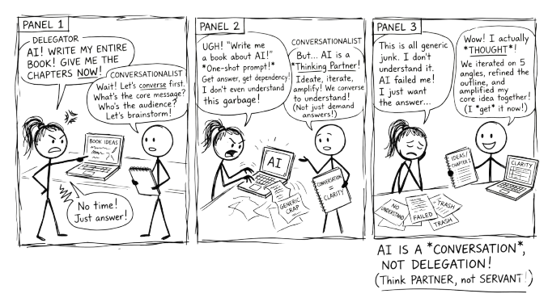

# Preface {.unnumbered}

{fig-alt="Comic strip: A delegator demands 'AI! Write my entire book! Give me the chapters NOW!' while a conversationalist says 'Wait! Let's converse first. What's the core message? Who's the audience?' Three panels later, the delegator has generic junk they don't understand. The conversationalist has something they actually thought through. Punchline: AI is a conversation, not delegation. Think partner, not servant."}

## Why This Book Exists

I wrote this book because I kept watching smart people use AI badly.

Not badly in a technical sense. They could find the tools, type the prompts, and get outputs. But they were delegating their thinking to a machine and accepting whatever came back. The AI was doing the work, and the human was doing the clicking. The outputs looked polished. The thinking behind them was hollow.

There is a different way. Instead of delegating to AI, you can converse with it. You can use it to brainstorm, to challenge your assumptions, to stress-test your reasoning, to explore angles you would not have considered alone. When you do this, the AI does not replace your thinking. It amplifies it.

This book teaches you how.

## Who This Book Is For

This book is for anyone who uses AI as a thinking tool. Students, professionals, researchers, educators: if you interact with large language models as part of your work or study, this book will change how you approach those interactions.

You do not need a technical background. You do not need to write code. You need curiosity, a willingness to think critically, and a problem worth solving.

If you work with AI in any capacity, or plan to, this book will give you a framework for doing it well.

## What This Book Is Not

This is not a guide to specific AI tools. It does not teach you how to use ChatGPT, Claude, or any particular platform. Interfaces change; the principles here do not.

It is not a prompt engineering manual. You will learn to structure prompts well, but the book argues that the prompt is the beginning of the conversation, not the point of it. If you are looking for a library of copy-paste prompts to get finished outputs in one shot, this is the wrong book.

It is not about AI apps that embed intelligence into other software, such as writing assistants, email autocompletes, and coding copilots. Those tools run on prompts someone else wrote. This book is about conversations you control yourself. Both have their place, but they are different activities.

And it is not a book that tells you AI will solve your problems. It is a book that argues the opposite: you will solve your problems, and AI can help you think more clearly along the way.

## If You Are Feeling Uncertain

That is worth naming. Many people experience a quiet anxiety: a sense that everyone else has figured this out already, that the technology is moving too fast, that they are falling behind. That feeling is nearly universal and rarely admitted. You are not behind. The technology is genuinely new, it is genuinely confusing, and the people who appear to have it all figured out are mostly just a few weeks ahead. This book meets you wherever you are.

## How This Book Is Structured

Part 1 gives you enough understanding of AI and large language models to use them well. Part 2 establishes the principles that make AI conversations productive rather than passive. Part 3 gives you practical tools and techniques you can use immediately. Part 4 shows it all working together across disciplines, and closes with the argument that matters most: the goal is not to get AI to do more, but to become more capable yourself.

## How to Read This Book

This is not a textbook and it is not a research paper. The ideas here reflect one practitioner's perspective, informed by research, experience, and ongoing experimentation. They are starting points, baselines to work from as you discover your own approach to AI.

Where claims rest on published research, you will find pointers in the Further Reading appendix (@sec-further-reading). Where they rest on practice and observation, that should be obvious from the writing. In both cases, the advice in this book applies to itself: engage with it critically, push back where your experience says otherwise, and make the ideas your own. A book about not delegating your thinking to AI would be contradicting itself if it asked you to accept its arguments uncritically.

## Conventions Used in This Book

Throughout the book you will encounter coloured callout boxes. Each serves a different purpose.

::: {.callout-tip title="Try this"}
**Green boxes** are hands-on exercises you can do right now, usually in two to ten minutes. They give you a way to experience the concept rather than just read about it.
:::

::: {.callout-note title="Key idea"}
**Blue boxes** highlight important observations, ready-to-use prompts, or ideas worth pausing on.
:::

::: {.callout-warning title="Watch out"}
**Yellow boxes** flag common mistakes, weak examples, or things that look right but are not.
:::

::: {.callout-important title="Critical point"}
**Red boxes** mark habits or principles that are essential. Do not skip these.
:::

You will also find tables throughout the book that compare approaches, map strategies across domains, or summarise frameworks. These are reference material, worth bookmarking, not just reading once.

## How This Book Was Written

This book was written using the methodology it describes.

It began as a set of Python notebooks on computational thinking, practical exercises developed for teaching. Those notebooks evolved, through multiple conversation loops with AI, into the sibling book *Converse Python, Partner AI*. That process surfaced a methodology that was broader than programming: the principles of conversation over delegation, of staying critical, of using AI to amplify thinking rather than replace it. This book is the result of extracting and generalising that methodology for a wider audience.

At every stage, the process looked like what you will read about in @sec-conversation-loop. Ideas were brainstormed, challenged, restructured, and refined across dozens of conversations. AI drafted, the author pushed back. AI suggested structures, the author broke them and rebuilt them. The frameworks in this book (RTCF, VET, the eight techniques) were tested in the writing of the book itself. Where AI was sycophantic, it was told to stop. Where it was generic, it was pressed for specifics. Where it was wrong, it was corrected.

You may be thinking: if this book was written with AI, why should I trust it? That reaction is understandable, and this book has a name for it: the AI Dismissal Fallacy (@sec-staying-critical). The quality of an idea does not depend on whether a human or a machine contributed to its development. What matters is whether the author can explain, defend, and stand behind every sentence. The answer is yes, because conversation, real conversation with pushback and judgement, is how the thinking was done.

Transparency about process is more important than the comfort of pretending AI was not involved. Every professional will face this question soon enough. This book's answer is to show the work.

**Tools used in producing this book:**

- **Claude** (Anthropic): conversational AI partner for drafting, iterating, and refining text
- **Claude Code**: command-line tool for managing files, building, and publishing
- **Google Gemini (Nano Banana 2)**: generative AI for creating the comic strip illustrations (Chapters 1–8)
- **FLUX Playground** (Black Forest Labs): generative AI for creating the comic strip illustrations (Chapters 9–14)
- **Python** and **Jupyter Notebooks**: the original medium in which the ideas were developed and tested; also used to generate the cover image (`create_cover.py`)
- **Quarto**: open-source publishing system used to produce the HTML, PDF, and epub editions
- **Git and GitHub**: version control and hosting, including GitHub Pages for the web edition

## Ways to Engage with This Book

A book about conversation should be available in more than one form. Pick the format that fits how you think and learn.

- **Read it online.** The full book is freely available at the companion website, with dark mode, search, and navigation.
- **Read it on paper or e-reader.** Available as a paperback and ebook through Amazon KDP, for those who prefer to read offline or away from a screen.
- **Download the PDF or epub.** Generated from the same source, available from the website.
- **Converse with it.** The online edition includes a chatbot grounded in the book's content. Ask it questions, challenge its answers, and practise the methodology on the methodology itself. You can also use the `llm.txt` file to paste the entire book into ChatGPT, Claude, or any AI tool for a deeper conversation.
- **Listen to it.** Upload the `llm.txt` file to Google NotebookLM and generate an audio overview or podcast-style discussion of the content.
- **Explore the source.** The full source is on GitHub, including every chapter, the build system, and the revision history. DeepWiki provides an AI-navigable view of the repository.
- **Practise the frameworks.** Interactive tools on the companion site let you build RTCF prompts, analyse your existing prompts, and assess your AI readiness (see @sec-interactive-tools).
- **Browse all books.** This book is part of a series. See all titles at books.borck.education (https://books.borck.education).

The online version is always the most current. The printed and ebook editions are updated periodically. If you purchased a copy and want the latest version, re-download it; you get the current edition.

## The Sibling Book

This book has a companion: *Converse Python, Partner AI*, which covers the same methodology through the lens of Python programming. If you are a developer or data scientist, that book may be a better fit. If you are not, you are in the right place.

Both books are independently complete. You do not need one to benefit from the other.
