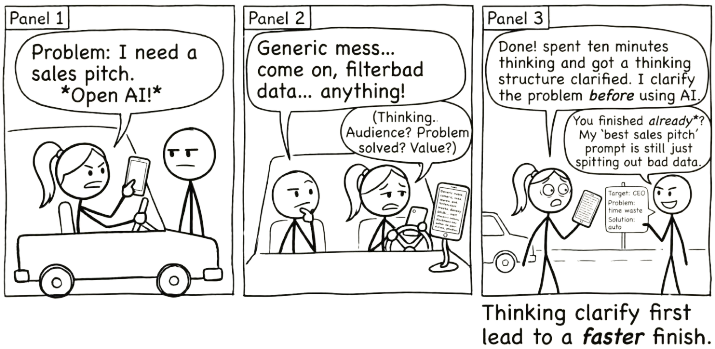

# AI Last {#sec-ai-last}

{fig-alt="Comic strip: One stick figure opens AI immediately and gets a generic mess. Another spends ten minutes thinking first, clarifies the problem, then uses AI and finishes faster. Punchline: Thinking first leads to a faster finish."}

There is a temptation, once you have access to a powerful AI, to reach for it immediately. Problem appears, AI gets asked. Every time.

Resist that.

The best results come when AI is the last tool you use, not the first. Not because AI is bad at what it does. Because you are better than you think, and the habit of reaching for AI before you have tried anything else will quietly erode the skills that make you valuable.

This chapter is about a simple discipline: solve as much as you can before you involve AI. Then hand it the part you genuinely cannot handle alone.

> The best prompt is the one you almost did not need, because you did most of the thinking yourself.

## Why "AI Last" Works

Four reasons. Each reinforces the others.

**You already know more than you think.** Most problems you encounter in your daily work have well-understood solutions. You have notes from last time. You have experience. You have colleagues, reference materials, and search engines. The vast majority of what you need to accomplish does not require a large language model. It requires you, doing the work you are already capable of doing.

**Effort compounds.** This one cuts both ways. The more thinking you do, the more capable you become. The less thinking you do, the less capable you become. Every time you skip the hard part and hand it straight to AI, you lose a small opportunity to strengthen your own understanding. One skipped opportunity is nothing. A thousand of them over a year is a noticeable decline in your ability to reason through problems independently.

**Smaller, focused prompts produce better results.** When you have already narrowed a problem down to the specific hard part, the AI has less ambiguity to deal with. You are not dumping an entire mess into the conversation and hoping for the best. You are asking a precise question. Precise questions get precise answers. Vague ones get generic output you will spend twenty minutes fixing.

**You stay the expert.** You are the one who understands your work, your context, your goals. AI does not know what you had for lunch, let alone why your project matters or what trade-offs are acceptable. When you do the groundwork yourself, you maintain the deep understanding that lets you evaluate whether AI's contribution is actually good.

## The Five-Step Workflow

This is not a rigid process. It is a habit of mind. Once it becomes natural, you will not think about the steps. You will just work this way.

### 1. Start with what you know

Before you open any AI tool, start working. Write your first draft. Sketch your plan. Outline your argument. Organise your data. Get as far as you can on your own.

This is not about proving something. It is about activating what you already know. You will often surprise yourself with how far you get. And even when you get stuck, the work you have done gives you a much clearer picture of where the real difficulty lies.

### 2. Use your own tools for routine problems

You have tools that are faster, more reliable, and more precise than AI for most routine tasks. Your notes from previous projects. Your bookmarks. A quick search. A conversation with a colleague. Reference materials and style guides. Templates you have built over time.

These resources are deterministic. They give you the same right answer every time. AI gives you a plausible answer that might be right. For anything you can solve with a known method, use the known method.

### 3. Identify the genuine sticking point

This is the critical step. After you have done your own work and used your own resources, ask yourself: what specifically am I stuck on?

Not "this is hard." Not "I don't feel like figuring this out." But a concrete, specific question. What do I not understand? What am I missing? What is the piece I cannot reason through on my own?

The more precisely you can name the sticking point, the more useful the next step becomes.

### 4. Now bring in AI, scoped tightly

Give the AI the specific problem, the relevant context, and a clear question. Not your entire project. Not a vague plea for help. The particular thing you are stuck on, framed in a way that makes it easy for the model to give you something useful.

Compare these two approaches:

"Help me with my presentation."

Versus:

"I am writing a presentation on supply chain disruptions for a non-technical audience. I have three case studies ready but I am struggling to connect them into a single narrative. Here are the three cases. What is the through-line?"

The first prompt will get you a generic presentation outline you do not need. The second will get you a genuine insight you can use.

The difference is that in the second case, you did the work first. You gathered the case studies. You structured the presentation. You identified exactly where you were stuck. The AI is handling the one part where it can add value you could not easily generate yourself.

### 5. Validate and integrate the output yourself

AI gives you a draft, not a finished product. You still own the result.

Read what it gives you critically. Does it actually answer your question? Is it accurate? Does it fit with the rest of your work? AI can sound confident while being wrong. It can produce something grammatically perfect that misses the point entirely.

Your job is to take what is useful, discard what is not, and integrate the result into your own work in a way that holds together. If you cannot evaluate whether the AI's output is good, that is a sign you skipped steps one through three.

::: {.callout-tip title="Try this (2 minutes)"}
Take something you have already written, such as an email draft, meeting notes, or a paragraph from a report. Paste it into AI and ask "Help me tighten this up." Compare the result to what you would get from a blank prompt asking AI to write the same thing from scratch. The version that started with your voice will sound like you. The version from scratch will sound like a machine. AI is far better at refining your thinking than generating from nothing.
:::

## Where AI Earns Its Keep

This principle is not "never use AI." It is "use AI where it adds value you cannot easily generate yourself."

That includes exploring unfamiliar domains where you lack expertise. It includes processing or transforming information at a scale that would take you hours to do manually. It includes brainstorming approaches to genuinely novel problems, the ones where your own experience and your usual resources do not give you enough to work with.

The key distinction is between using AI as a crutch for laziness versus using it as a lever for capability.

A crutch replaces effort you should be making. It feels efficient in the moment. Over time, it weakens you. You lose the ability to do the thing yourself, and you become dependent on a tool that does not always get it right.

A lever multiplies effort you are already making. You have done the thinking. You have narrowed the problem. You bring in AI to push past a specific barrier. The result is better than what you could have done alone, and you understand why it is better because you did the groundwork.

## The Compound Effect

This is worth saying plainly: how you use AI today shapes what you are capable of tomorrow.

If you use it as a crutch, you will gradually lose the ability to work without it. You will not notice this happening. It will feel like efficiency right up until the moment you face a problem AI cannot help with, and you realise you have forgotten how to think it through.

If you use it as a lever, you get the opposite effect. You stay sharp. Your own skills keep developing. And because you bring better questions to the AI, you get better answers. The human gets stronger. The collaboration gets better. The work improves.

::: {.callout-tip title="The compound effect"}
How you use AI today shapes what you are capable of tomorrow. Use it as a crutch and your skills erode. Use it as a lever and they compound.
:::

AI Last is not about doing things the hard way. It is about doing things the smart way: you handle what you can, AI handles what you cannot, and the line between those two stays honest.

The average-versus-precise, small-versus-large framework from @sec-what-are-llms helps you judge where that line sits for any given task. AI Last matters least in the sweet spot (small, average tasks where a draft is all you need) and most in the danger zone (large, precise tasks where confident-looking output masks structural problems). The more a task demands precision and the more complex its dependencies, the more important it is that you have done your own thinking before bringing AI into the conversation. That is not a rule about AI. It is a rule about the kind of work that matters.

::: {.callout-tip title="Try this (2 minutes)"}
Give AI a vague prompt, then rewrite it with specific context, audience, and purpose. Compare the two outputs. The difference between them is not the AI getting smarter. It is your thinking making the AI useful.
:::
