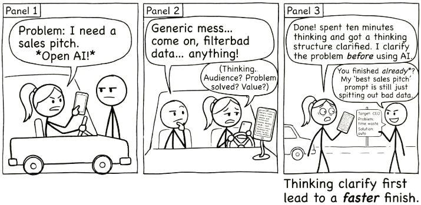

# AI Last {#sec-ai-last}

{fig-alt="Comic strip: One stick figure opens AI immediately and gets a generic mess. Another spends ten minutes thinking first, clarifies the problem, then uses AI and finishes faster. Punchline: Thinking first leads to a faster finish."}

> The best time to use AI is after you have done enough thinking to know what to ask.

There is a temptation, once you have access to a powerful AI, to reach for it immediately. Problem appears, AI gets asked. Every time.

Resist that.

Use AI after a short first attempt when that helps you identify the question and preserve the skill you want to practise. This is a default for deliberate work, not a ban on early assistance.

This chapter is about a simple discipline: solve as much as you can before you involve AI. Then hand it the part you genuinely cannot handle alone.

## A useful default, with exceptions

The evidence and limits belong in @sec-cognitive-offload. Here the aim is operational: arrive with a purpose, preserve a first attempt where useful, and check what changes.

“Last” does not mean exhausting yourself before accepting help. If you lack the vocabulary to begin, need an accessible format, or are dealing with an unfamiliar task, ask early for orientation or a small next step. Do not turn a learning habit into a test of worthiness. You can obtain help and still make the decisions.

## The Five-Step Workflow

This is not a rigid process. It is a habit of mind. Once it becomes natural, you will not think about the steps. You will just work this way.

### 1. Start with what you know

Before you open any AI tool, start working. Write your first draft. Sketch your plan. Outline your argument. Organise your data. Get as far as you can on your own.

This is not about proving something. It is about activating what you already know. You will often surprise yourself with how far you get. And even when you get stuck, the work you have done gives you a much clearer picture of where the real difficulty lies.

### 2. Use your own tools for routine problems

You have tools that are faster, more reliable, and more precise than AI for most routine tasks. Your notes from previous projects. Your bookmarks. A quick search. A conversation with a colleague. Reference materials and style guides. Templates you have built over time.

A calculator can reliably execute a specified calculation; notes, searches, and colleagues can still be mistaken or out of date. Prefer a known, checkable method when it suits the task, and inspect the inputs as well as the result.

### 3. Identify the genuine sticking point

This is the critical step. After you have done your own work and used your own resources, ask yourself: what specifically am I stuck on?

Not "this is hard." Not "I don't feel like figuring this out." But a concrete, specific question. What do I not understand? What am I missing? What is the piece I cannot reason through on my own?

The more precisely you can name the sticking point, the more useful the next step becomes.

### 4. Now bring in AI, scoped tightly

Give the AI the specific problem, the relevant context, and a clear question. Not your entire project. Not a vague plea for help. The particular thing you are stuck on, framed in a way that makes it easy for the model to give you something useful.

Compare these two approaches:

"Help me with my presentation."

Versus:

"I am writing a presentation on supply chain disruptions for a non-technical audience. I have three case studies ready but I am struggling to connect them into a single narrative. Here are the three cases. What is the through-line?"

The second prompt identifies the actual difficulty and supplies material to work with. Check whether the resulting through-line fits the cases; the additional context does not guarantee a useful insight.

The difference is that in the second case, you did the work first. You gathered the case studies. You structured the presentation. You identified exactly where you were stuck. The AI is handling the one part where it can add value you could not easily generate yourself.

### 5. Validate and integrate the output yourself

AI gives you a draft, not a finished product. You still own the result.

Read what it gives you critically. Does it actually answer your question? Is it accurate? Does it fit with the rest of your work? AI can sound confident while being wrong. It can produce something grammatically perfect that misses the point entirely.

Your job is to take what is useful, discard what is not, and integrate the result into your own work in a way that holds together. If you cannot evaluate the output, identify the missing knowledge or ask a qualified person to review it. Sometimes the task needs expertise you have not yet acquired.

::: {.callout-tip title="Try this (2 minutes)"}
Take something you have already written, such as an email draft, meeting notes, or a paragraph from a report. Paste it into AI and ask "Help me tighten this up." Compare the result to what you would get from a blank prompt asking AI to write the same thing from scratch. Compare which version preserves your intended meaning and style. Record any invented detail or lost qualification; neither route is guaranteed to be better.
:::

## Where AI Earns Its Keep

This principle is not "never use AI." It is "use AI where it adds value you cannot easily generate yourself."

That includes exploring unfamiliar domains where you lack expertise. It includes processing or transforming information at a scale that would take you hours to do manually. It includes brainstorming approaches to genuinely novel problems, the ones where your own experience and your usual resources do not give you enough to work with.

## Stop when the useful work is done

Set a completion test before asking for another revision: the answer addresses the sticking point, the consequential claims are checked, and you can explain the change you are accepting. More turns are not inherently better.

Keep your first attempt beside the final version. Note one contribution you accepted and one you rejected or changed, with a reason for each. This record is more informative than whether the final prose “sounds human.”

## Independent practice: show the sticking point

**Time:** 15 minutes. Pick a task small enough to begin now. Work for five minutes with your usual notes or tools. Write the part you can already handle and one question you cannot yet answer.

Draft a request that asks for help with that question only. You do not need to send it. Compare it with a request to do the entire task and identify what judgement you would lose visibility into.

**Artefact:** your attempt, the scoped request, and a completion test. **Success:** another person can identify the actual difficulty and how you intend to check the help. If you finish without AI, that is a successful outcome.
