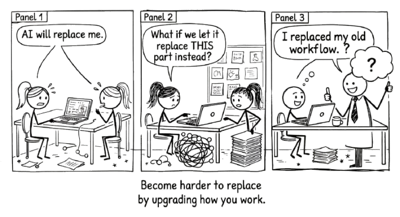

# Becoming More Capable {#sec-becoming-capable}

{fig-alt="Comic strip: A stick figure worries 'AI will replace me.' Another asks 'What if we let it replace THIS part instead?' Panel 3: 'I replaced my old workflow.' Punchline: Become harder to replace by upgrading how you work."}

This book was never about AI.

It was about you.

The tools will change. The models will get faster, cheaper, more capable. The interfaces will shift. The names will change. None of that matters as much as what happens to the person sitting across from the machine.

The question this book has been answering, from the first page, is not "how do I use AI well?" It is "how do I become more capable by thinking alongside it?"

Those are different questions. The first one makes you a better operator. The second one makes you better at your work, with or without the tool.

> You started this book learning how to work with AI. You are finishing it having learned how to think more clearly. That was always the point.

## The Compound Loop

Better questions produce better conversations.

Better conversations produce deeper understanding.

Deeper understanding produces better questions.

This is not a metaphor. It is what actually happens when you adopt the practices in this book. You start by learning to frame a precise question instead of dumping a vague request. That precision forces you to clarify your own thinking before the conversation begins. The conversation that follows is sharper because you were sharper going in. And what you learn from that sharper conversation makes your next question even better.

Each loop through the cycle leaves you slightly more capable than you were before. Not because the AI taught you something. Because the act of thinking alongside it forced you to articulate what you know, confront what you do not, and make decisions about what matters.

This is the compound interest of the conversational approach. Delegation produces outputs that sit in folders. Conversation produces understanding that compounds in your head.

## What You Actually Built

If you have been practising what this book describes, something has already changed. You may not have noticed it yet.

You think before you prompt. You draft before you ask for feedback. You iterate instead of accepting the first response. You push back when something sounds plausible but feels wrong. You ask the AI to challenge your reasoning, not just validate it.

These are not AI skills. They are thinking skills. The AI was the catalyst, but the capability is yours.

A professional who has spent six months in genuine conversation with AI is not someone who has learned to use a tool. They are someone who has learned to think more precisely, evaluate more critically, and articulate more clearly. Take the AI away and those skills remain. They are yours now.

That is the difference between augmentation and dependence. Dependence means you need the tool to function. Augmentation means the tool made you better, and "better" persists after the tool is gone.

## Your Expertise, Its Breadth

The subtitle of this book is a formula: your expertise plus AI's breadth equals amplified thinking.

Notice what comes first. Your expertise. Not the model's capability. Not the prompt technique. You.

AI brings breadth no human can match. It has processed more text, seen more patterns, encountered more framings than any individual could absorb in a lifetime. That breadth is genuinely valuable. But breadth without direction is noise. It is your expertise that turns breadth into insight. Your context, your judgement, your experience of what actually works in the specific situation you are facing.

The formula only works when both sides contribute. Strip out the AI and you lose the breadth. Strip out your expertise and you lose the direction. The amplification happens in the space between.

This is why the conversational approach matters more than any specific technique. Techniques are useful. They give you structure, starting points, ways to get unstuck. But the real leverage comes from the relationship between your knowledge and the model's range. That relationship deepens every time you engage with it honestly.

## What Does Not Compound

Delegation does not compound.

If you spent the last year asking AI to write your emails, draft your reports, and generate your analyses, you have a year's worth of polished outputs. You do not have a year's worth of growth. The outputs were consumed, forgotten, replaced by next week's outputs. Nothing accumulated in you.

Conversation compounds. Delegation does not. That distinction is worth more than every prompting trick in every guide ever written.

An honest note: the compound effect described here is a claim grounded in pedagogical theory, professional experience, and the well-documented benefits of reflective practice. It is not yet backed by multi-year longitudinal studies of AI-assisted thinking. Those studies are underway, but the technology is too new for definitive long-term evidence. The argument rests on the same foundation as any claim about deliberate practice: that structured engagement with challenging material builds capability, and passive consumption does not. If that principle holds (and centuries of evidence from education, music, medicine, and sport suggest it does) then the conversational approach should compound. But should is not proof. The honest position is confidence in the principle, humility about the timeline for evidence, and a commitment to revising the claim if the data says otherwise.

## The Loop, One Last Time

The Conversation Loop is simple. Define your question. Explore possibilities. Push back and refine. Make the result yours. Go around again.

That loop is not a technique. It is a description of what thinking with another mind looks like. The AI is the other mind. You are the one deciding when to explore, when to push back, when to stop, and when the output is truly yours. Every time you make those decisions well, you get better at making them. That is the compound effect in action.

The loop does not require AI. You can run it with a colleague, a mentor, a blank page. But AI makes it available on demand, at any hour, on any problem. The practice becomes as frequent as you want it to be. And frequency is what turns a technique into a capability.

::: {.callout-tip title="The compound test"}
Take the AI away. Are you better at your work than you were six months ago? If yes, you have been conversing. If no, you have been delegating.
:::

## The Closing Argument

There is a line that has appeared twice before in this book, and it belongs here at the end.

Judgement cannot be delegated to something that has read everything but experienced nothing.

That sentence is not a limitation of AI. It is a statement about what makes you irreplaceable. Your experience. Your judgement. Your ability to weigh competing priorities, read a room, know when the data is pointing in the right direction and when it is lying to you. No model has that. No model will.

What a model can do is help you sharpen those capacities. It can surface what you had not considered. It can pressure-test your reasoning. It can show you the gap between what you think you know and what you actually know. But only if you stay in the conversation. Only if you do the thinking.

The goal was never to get AI to do more.

It was to become more capable yourself.

That is the practice. That is the point. And if you have read this far, you already know how to begin.
