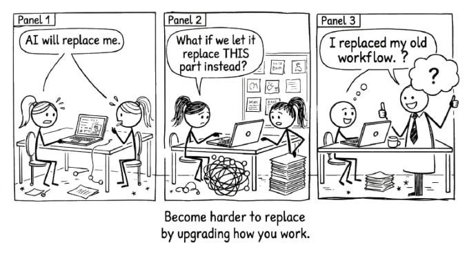

# Becoming More Capable {#sec-becoming-capable}

{fig-alt="Comic strip: A stick figure worries 'AI will replace me.' Another asks 'What if we let it replace THIS part instead?' Panel 3: 'I replaced my old workflow.' Punchline: Become harder to replace by upgrading how you work."}

> The goal was never to get AI to do more. It was to become more capable yourself.

## Show the change, do not assume it

Return to the first attempt you kept near the beginning of this book. Put it beside the final version and explain what changed.

Perhaps you narrowed the question. Perhaps you rejected a confident assertion, checked a source, or noticed a limit that the proposed answer concealed. Those are observable actions. Finishing the chapters, holding a long conversation, or producing polished prose is not enough to establish them.

The evidence should be small enough to inspect: a starting position, an intervention, an independent check, and the decision you made. That is what the capstone asked you to produce.

## The workshop, revisited

In the community-workshop case, the first proposal exceeded both the room capacity and the available time. The budget calculation happened to be right. Maya did not accept or reject the whole answer as a unit. She checked the parts against the source cards.

The corrected plan served eighteen participants in two groups of nine. It counted the facilitators, allowed reset time, and left the organiser's confirmation outstanding. The final message was useful because it preserved that limit.

The independent version changed the numbers. If you solved it without copying the worked timetable, you demonstrated transfer: the method survived a new case. If you missed a constraint, the check showed where to practise next. Both are more informative than whether an assistant congratulated you.

## What remains yours

You choose the task and the standards that matter. You contribute knowledge of the setting, ask for missing evidence, decide what to accept, and identify who has authority to act.

AI can contribute candidate explanations, alternatives, transformations, and challenges. Sometimes it will supply an idea you would not have found alone. Sometimes a calculator, source document, colleague, or specialist will be the better resource. Choosing among them is part of the capability this book is trying to build.

Do not interpret “own the result” as “I must perform every operation unaided.” Good work often depends on tools and other people. Ownership means that the limits and responsibilities are visible and that your claim does not exceed what you can support.

## A review of your own practice

Choose one piece of work from the last month. Ask four questions:

1. What did I believe before receiving assistance?
2. Which suggestion did I accept, reject, or materially change, and why?
3. Which consequential claim did I check somewhere other than the answer itself?
4. What can I now explain or do on a new example?

If you cannot answer one, identify a next action rather than writing a more flattering account of the process. You may need a source check, a simpler exercise, more domain knowledge, or another person's review.

Keep uncertainty in the record. “The source supports the schedule, but the organiser has not confirmed access” is stronger than pretending everything is settled.

## A sustainable next habit

Choose one habit for the coming week, not a promise to use every technique on every task.

You might begin important work with a five-minute first attempt. You might keep a claim/source column beside a draft. You might place a deliberate pause between planning and execution, or explain a result in your own words before sharing it.

Choose a task where the habit has a visible completion test. At the end of the week, examine one example. Did the pause expose a real issue? Did the source support the claim? Did you understand the change you accepted? Adjust the habit using that evidence.

There is no guarantee that each exchange compounds into lasting expertise. That is why the learning chapter separated assisted performance from independent transfer. Continue practising the capabilities you want to retain and check them on work that matters.

## Capability is not an employment forecast

These habits do not establish what employers will value, which roles will change, or what future models will do. Promises that human judgement is permanently unautomatable are as difficult to defend as promises that every role will disappear.

The narrower reason to practise is already sufficient: today you need to make decisions under uncertainty, communicate clearly, and avoid giving unsupported outputs more authority than they deserve. Those are useful aims without an economic guarantee attached.

If a task is routine, well specified, permitted, and independently checkable, sensible delegation may be appropriate. If it needs discussion, converse. If the evidence or permission is missing, stop or use another method. The decision map in the quick reference keeps all of those options available.

## Take stock without AI

**Time:** 20 minutes. Close the chat and choose a new, small task. Write the goal, relevant constraints, an initial approach, and how you would check it. You may use notes, a calculator, assistive tools, or an accessible format.

Compare your attempt with the record you made at the start of the book. Identify one improvement with evidence and one capability that still needs practice. Ask a colleague to challenge your explanation if someone is available; otherwise perform a second review after a break.

**Success:** you can show a specific change in how you approached or checked the work. You do not need to claim that the book transformed your intelligence or made you irreplaceable.

The next useful conversation begins with that honest account of where you are.
