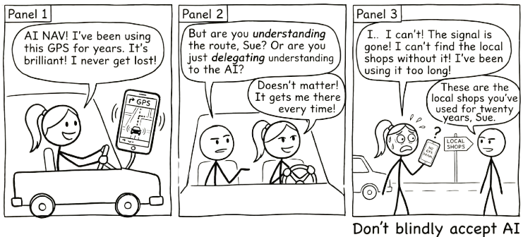

# Does AI Make Us Dumber? {#sec-cognitive-offload}

{fig-alt="Comic strip: A stick figure relies on AI navigation for years. When the signal drops, she can't find the local shops she's used for twenty years. Punchline: Don't blindly accept AI."}

## The Honest Version

I advocate for AI loudly and unapologetically. But advocacy without nuance is reckless.

So let's talk about the thing that worries people most. The thing that, if we're being honest, should worry us a little too.

Does AI reduce critical thinking?

The concern goes like this: when people use AI, they stop doing the hard cognitive work. They offload the thinking that actually builds understanding. They get better outputs but develop weaker minds. Over time, AI doesn't make them smarter. It makes them dependent.

This isn't a fringe concern. There's genuine research behind it. And anyone who's caught themselves pasting a question into ChatGPT without pausing to think has felt the truth of it.

It is also not a new concern. In 2008, Nicholas Carr asked "Is Google Making Us Stupid?" in *The Atlantic*, arguing that the internet was eroding our capacity for deep reading and sustained concentration. A decade earlier, similar fears accompanied the arrival of calculators in classrooms. Two millennia before that, Socrates argued against writing itself, warning that it would "create forgetfulness in the learners' souls, because they will not use their memories." Every powerful cognitive tool provokes the same fear: that by making thinking easier, we will stop thinking altogether.

So: is it true?

> The same tool that can deepen your understanding can make it effortless to avoid understanding altogether. The difference is not the tool. It is you.

The answer is more interesting than yes or no.

## What Cognitive Offload Actually Is

Cognitive offload is when you use an external tool to reduce the mental effort required for a task. You do it constantly:

- Writing a shopping list instead of memorising it
- Using a calculator instead of doing long division
- Checking a map instead of navigating from memory
- Setting a reminder instead of trying to remember

None of these make you "dumber." They free up cognitive resources for other things. The shopping list lets you think about recipes. The calculator lets you focus on the problem structure. The map lets you pay attention to traffic.

AI is the latest, and most powerful, cognitive offload tool we've encountered. And that's precisely why it feels different. Previous tools offloaded specific, well-defined tasks. AI can offload *thinking itself*. The drafting, the analysing, the reasoning, the evaluating.

That's what makes the question urgent.

## The Real Risk: Metacognitive Laziness

The concern isn't really about cognitive offload. It's about what happens to metacognition: the ability to monitor, evaluate, and regulate your own thinking.

When people use AI well, they:

- Generate a draft, then **evaluate** it against their own understanding
- Get AI feedback, then **decide** what to accept and what to reject
- Use AI to explore options, then **judge** which options make sense
- Read AI output, then **question** whether it's actually correct

When people use AI poorly, they:

- Generate a draft and submit it
- Get AI feedback and accept it
- Ask AI for the answer and copy it
- Read AI output and assume it's correct

The difference isn't whether they used AI. It's whether they **paused to think** about what AI gave them.

This is metacognitive laziness. Not a failure of intelligence, but a failure of self-monitoring. You stop asking "Do I understand this?" and start asking "Does this look right?"

And yes, this is a genuine risk.

## But Here's What We're Getting Wrong

The metacognitive laziness risk is real. What's *not* justified is the leap from "this risk exists" to "AI makes us dumber."

That leap assumes something worth scrutinising: that the way we've always learned is the only way learning works.

Many of us learned through grinding. Rote memorisation. Extensive worked examples. Long hours of solitary struggle. Repetitive practice until concepts stuck.

This worked. It built understanding, and those who went through it understandably value it. But when we see people *not* doing these things, we assume learning isn't happening.

That assumption is worth questioning.

When someone uses AI to explore a concept, asks follow-up questions, gets confused, tries a different angle, and eventually builds understanding through an iterative conversation, that's learning. It doesn't look like sitting alone with a textbook for three hours, but it's genuine engagement with material.

When someone uses AI to generate a first draft, then spends their time evaluating, restructuring, and improving it, they're doing higher-order thinking (evaluation, synthesis) earlier in the process. They skipped some lower-order work. That's not the same as skipping the thinking.

When someone uses AI to get unstuck on a problem they'd otherwise abandon, they continue engaging with the material. Without AI, they might have given up entirely. With AI, they kept going. Which outcome produced more understanding?

The question isn't whether you're doing the *same* cognitive work. It's whether you're doing *valuable* cognitive work.

## Learning Slower, Learning Different

Here's a reframe that might be more accurate than "AI reduces critical thinking":

AI changes the path to understanding.

You might learn certain things more slowly when you use AI as a crutch for recall. But you might learn *other* things faster, like how to evaluate arguments, synthesise perspectives, and exercise judgement about quality.

Consider calculators. When they became widespread, people stopped memorising multiplication tables as thoroughly. Some argued this was catastrophic. But people who used calculators could engage with more complex mathematical problems earlier, problems that would have been inaccessible if they'd had to do every calculation by hand.

Did calculators "make people dumber at arithmetic"? In some narrow sense, yes. Did calculators reduce mathematical capability overall? No. They redirected it. People lost some computational fluency but gained access to higher-level mathematical thinking.

AI may be doing something similar at a much larger scale. You may develop less capacity for certain types of unaided recall and composition. But you may develop *more* capacity for evaluation, judgement, synthesis, and critical analysis.

That outcome, though, is not automatic. It depends entirely on how you use the tool.

## The Flipped Pyramid

There is something happening in practice that the "making us dumber" framing completely misses.

For decades, education has followed a predictable sequence. You spend your first years learning fundamentals: definitions, formulas, procedures, foundational concepts. You memorise, you practise, you drill. Only later — sometimes much later, in a final-year capstone project or a postgraduate thesis — do you get to do something genuinely creative with what you have learned. The interesting work is the reward for years of grinding through the basics.

Bloom's taxonomy describes this progression. At the base: remember, understand. In the middle: apply, analyse. At the top: evaluate, create. The traditional path moves upward, one level at a time.

AI flips the pyramid upside down.

With AI as a thinking partner, a first-year student can begin at the creative level. They can design, prototype, and build things that would previously have required years of accumulated skill. They can explore concepts by making things with them, not just reading about them. And when their creative ambition runs into a gap in their foundational knowledge — when they need to understand something to make their idea work — they dig down and learn it. Not because a syllabus told them to, but because their own project demands it.

This is student-push rather than syllabus-pull. The student's curiosity and creative ambition drive them into the fundamentals, rather than the curriculum dragging them through fundamentals toward a distant promise of creative work. The learning still happens. The order is different.

An educator might set a creative assignment: represent a methodology from your discipline as a narrative comic strip. Before AI, this was nearly impossible for most students — they did not have illustration skills. With AI, they can generate images that are good enough to carry a concept, not professional-grade, but sufficient for visual storytelling. The assignment becomes about understanding the methodology deeply enough to explain it as a narrative, not about drawing ability. AI lowered the barrier to entry. The thinking got harder, not easier.

But here is the critical variable. When students delegate the creative assignment to AI — paste the brief, accept the output, submit — the result is mediocre. AI is exceptionally good at producing the average. It generates text, images, and ideas that sit comfortably in the middle of every distribution: competent, plausible, and indistinguishable from everyone else's delegated output.

When students converse with AI — iterate, push back, bring their own perspective, demand specifics — the results are extraordinary. The conversation forces them into the material. They have to evaluate what AI produces, decide what works, identify what is missing, and articulate what they actually want. That is higher-order thinking happening in real time, driven by the student's own engagement, not by a textbook's sequence of chapters.

The difference between mediocre and extraordinary is not whether AI was used. It is whether the student stayed in the conversation.

This points to something that the "making us dumber" debate consistently misses. The question is not whether AI changes how we learn. It obviously does. The question is whether the new way of learning produces genuine understanding. And the evidence from practice suggests that it can — but only when the learner remains an active participant rather than a passive consumer of AI output.

We are all learning to navigate this. Educators, professionals, students — nobody has a settled answer yet. But the early signs are clear: AI does not make us dumber. It makes it possible to learn differently. Whether "differently" means "better" or "worse" depends entirely on whether you stay in the conversation.

## Toward Hybrid Intelligence

Maybe the framing of "AI vs. human thinking" is itself the problem.

What if the future isn't about preserving *unaided* human cognition in its traditional form, but about developing hybrid intelligence: the ability to think effectively in partnership with AI?

What hybrid intelligence looks like:

- Knowing when to think independently and when to think with AI
- Being able to evaluate AI output with genuine understanding
- Using AI to extend your capabilities without losing your foundation
- Maintaining metacognitive awareness while leveraging cognitive offload
- Developing judgement about *when* offloading is appropriate and when it's not

This isn't a lesser form of intelligence. It's a different, and arguably more relevant, form of intelligence for a world where AI is everywhere.

The most effective AI users aren't those who delegate everything to AI, nor those who refuse to use it. They're the ones who've developed a symbiotic relationship. They know what they bring (context, judgement, values, experience) and what AI brings (breadth, speed, pattern recognition, tirelessness).

This symbiosis is itself a skill. It requires self-awareness about your own strengths and blind spots. Understanding of AI's capabilities and limitations. The discipline to pause and think before accepting AI output. The humility to recognise when AI has a better perspective. The confidence to override AI when your judgement says otherwise.

## What History Actually Shows

There is a fear underneath the "AI makes us dumber" question that is worth naming directly: the fear that AI will make us obsolete. That the skills we have spent years building will stop mattering.

History suggests the opposite.

When ATMs arrived, people predicted the end of bank tellers. Instead, cheaper branches meant more branches, and total teller employment rose. The job changed. Tellers spent less time counting cash and more time advising customers. The human skill that mattered shifted from processing to judgement.

When spreadsheets arrived, people predicted the end of accountants. Instead, the cost of financial analysis dropped so far that demand for it exploded. Every department wanted forecasts, models, scenarios. There were more accounting jobs after spreadsheets, not fewer. The work was different, but there was more of it.

When containerised shipping arrived, people predicted the end of dock workers. Instead, global trade expanded so dramatically that port employment grew. The containers did not eliminate the work. They changed its shape and multiplied its volume.

This pattern has a name: the Jevons Paradox. When a technology makes something cheaper or more efficient, demand for that thing tends to increase, not decrease. The technology does not replace the work. It refactors it. The routine parts get absorbed by the tool. The parts that require judgement, context, creativity, and trust become more central, not less.

AI is following the same pattern. The people who will thrive are not the ones who resist AI or the ones who delegate everything to it. They are the ones who develop the skill of working alongside it: knowing when to lean on it, when to override it, and when to do the hard thinking themselves.

That skill is not threatened by AI. It is amplified by it.

## The Conversation, Not Delegation Connection

This whole discussion circles back to a foundational idea from @sec-delegation-trap: conversation, not delegation.

When you delegate to AI, "just give me the answer," cognitive offload becomes cognitive abdication. You get output without understanding. Over time, your own capabilities erode.

When you converse with AI, "help me think through this," cognitive offload becomes cognitive amplification. You engage with material at a deeper level, with AI as a thinking partner that challenges, extends, and enriches your understanding.

The difference between offload that harms and offload that helps is whether the human stays in the loop. Not just approving output, but actively thinking alongside the tool.

## What to Actually Worry About

Instead of the broad fear that "AI makes us dumber," here are the specific risks worth paying attention to.

**Loss of productive struggle.** Some difficulty is valuable. When you wrestle with a concept and eventually break through, that struggle builds durable understanding. If AI eliminates *all* struggle, it may eliminate the understanding that comes with it. The fix is simple in principle: attempt the hard thing first. Use AI to get unstuck, not to avoid getting stuck.

**Illusion of understanding.** You may *feel* you understand something because you've read AI's clear explanation, without having built genuine comprehension. You can parrot the explanation but can't apply it to a new context. The test: can you explain it in your own words? Can you use it in a situation you haven't seen before?

**Erosion of foundational skills.** Some skills serve as foundations for higher-order thinking. If you skip the foundations, you may struggle with the complex work that depends on them. The nuance: not every traditional skill is equally foundational. Be intentional about which foundations matter. Protect those. Let go of the ones technology has genuinely superseded.

**Metacognitive atrophy.** The biggest risk. You stop monitoring your own understanding because AI gives you a false sense of competence. The antidote is the simplest thing in the world, and the hardest to maintain: keep asking yourself, "Do I actually understand this, or does it just sound right?"

::: {.callout-tip title="The honest position"}
The goal is not to avoid cognitive offload. It is to offload wisely -- knowing when to lean on AI and when to lean on your own mind.
:::

## A More Honest Position

Here's where I land.

AI doesn't make us dumber. But it does make it easier to *be* dumber. To coast, to accept, to stop thinking.

The same tool that can deepen understanding can also provide a comfortable path to intellectual laziness. The difference is self-awareness and intentional practice.

The goal isn't to avoid cognitive offload. It's to offload wisely. To know when to lean on AI and when to lean on your own mind. To maintain the metacognitive habits that turn AI from a crutch into a catalyst.

That's harder than avoiding AI. It's harder than embracing AI uncritically. It requires ongoing attention and honest self-reflection.

But it's the honest position. And honest positions, in the long run, serve us better than comforting certainties in either direction.

> Cognitive offload isn't the enemy. Cognitive abdication is.
