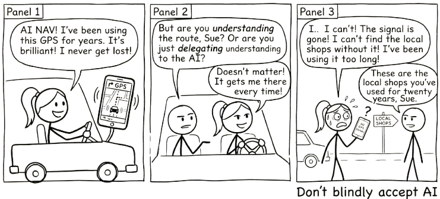

# Does AI Make Us Dumber? {#sec-cognitive-offload}

{fig-alt="Comic strip: A stick figure relies on AI navigation for years. When the signal drops, she can't find the local shops she's used for twenty years. Punchline: Don't blindly accept AI."}

> The question is not whether AI changes how we think. It is whether we notice.

## Ask which capability, under which conditions

You finish a task more quickly with AI. Did you learn more, less, or something different? The finished artefact cannot answer that question on its own.

This chapter separates three outcomes: performance while help is available, understanding that transfers to another task, and capability retained when the help is removed. They can move in different directions. A polished answer may accompany weak understanding; a difficult practice session may produce useful learning without an impressive deliverable.

That distinction is more useful than declaring that AI makes people either smarter or dumber. It also makes the question testable in your own work.

## Offloading can be sensible

We already distribute mental work across notes, calculators, reminders, diagrams, and other people. Remembering every appointment is not a prerequisite for good judgement. Nor does needing a tool make someone's reasoning less valid.

What matters is the capability you intend to practise. If the goal is to learn how to evaluate an argument, a supplied draft can be useful material. If the goal is to learn to construct that argument independently, having a model supply the entire structure may remove some of the practice you need.

The same assistance can therefore be appropriate for one task and counterproductive for another. State the learning goal before deciding what to offload.

## What the evidence does and does not say

A 2025 study by Lee and colleagues surveyed knowledge workers about their use of generative AI and critical thinking. Its self-reported associations are useful evidence about perceived effort and checking practices. They are not a direct measurement of lost intelligence or proof that using AI causes cognitive decline. The design and outcome measure matter. [Lee et al., study and methods](https://www.microsoft.com/en-us/research/wp-content/uploads/2025/01/lee_2025_ai_critical_thinking_survey.pdf)

Bastani and colleagues studied AI assistance in high-school mathematics, including performance after assistance was removed. Their findings support concern about some unguarded uses and the importance of how help is designed. They do not establish that every learner, subject, or tool has the same outcome. [Generative AI without guardrails can harm learning](https://doi.org/10.1073/pnas.2422633122)

Read both kinds of evidence at the level they support. A survey can identify reported behaviour without isolating causation. A controlled educational study can test a particular intervention without settling its effects in every setting. Neither licenses the claim that one copied answer permanently damages a person's mind.

My practical recommendation follows from that distinction: preserve some occasions to attempt, explain, and transfer the work yourself. Treat conversation as a way to organise that practice, not as a scientifically proven guarantee that every AI exchange builds skill.

## The risk is invisible completion

The warning sign is not that you received help. It is that completion has become your only test.

You submit a summary but cannot identify its main claim. You reuse code but cannot predict what a changed input will do. You accept a recommendation but cannot say which source supports it. The artefact may be useful, yet the learning outcome remains unestablished.

A short explanation exposes that gap. It can be spoken, drawn, demonstrated, or written. Do not confuse verbal fluency with understanding: a hesitant explanation with correct reasoning can be stronger than a confident recital.

If you cannot yet explain the result, ask for a smaller example or a hint. Then attempt that example yourself. Asking the model whether you understand is less informative than demonstrating the relevant action.

## Assistance can keep someone in the task

There is also a cost to withholding help. A learner who is blocked by an unfamiliar term, an inaccessible format, or an overwhelming blank page may abandon the task entirely. Assistance that makes the next step manageable can preserve engagement.

That is why “always struggle alone first” is a poor universal rule. Start with enough independent thought to identify the purpose when possible. If even that is difficult, ask for orientation, a question, or a simplified representation. You can still own the subsequent judgement.

Imagine a volunteer faced with a room-booking rule. They ask for it in plain language, then use the original rule to check the explanation and calculate capacity themselves. The model helped with access to the problem; it did not have to make the decision.

## Projects and fundamentals can support each other

An interesting project can reveal a knowledge gap worth filling. Someone planning a community workshop discovers that they need to distinguish participants from total occupancy. Someone analysing feedback discovers that a label and a verified outcome are different things.

Working from a project into a fundamental idea can be productive. It is not proof that foundational practice is obsolete. Keep returning to the underlying calculation, concept, or evidence so that the project's success does not depend on a chain of unexplained suggestions.

Similarly, evaluation and creation are not always the final rungs of a fixed learning ladder. A beginner can attempt a creative task while still needing explicit instruction in its components. Choose the sequence that exposes and addresses the gap, rather than treating a taxonomy as a universal order.

## A small comparison you can run

**Time:** two sessions of 15 minutes, preferably on different days. **Inputs:** two modest tasks of similar difficulty, such as explaining two related concepts or planning two short activities.

For the first task, work from your own notes and record where you get stuck. For the second, use AI assistance if available, preserving what it contributed. Do not pretend the tasks are perfectly matched; this is a personal learning check, not an experiment establishing causation.

In the later session, close both drafts and attempt a new variant of each task. Check the result against a source, worked answer, or knowledgeable person. Record what you can now do, what you still need help with, and which parts you merely recognised when the answer was visible.

Without AI, compare an independently attempted task with one for which you first read a worked example. The question remains whether you can use the idea on a new problem.

**Success:** the record distinguishes assisted completion from independent transfer. An honest “I cannot yet do this” is more useful than awarding yourself understanding because the first output looked good.

## Decide what to keep practising

Choose one capability that matters to you: constructing an argument, estimating time, inspecting a claim, or noticing a hidden constraint. Protect a small amount of practice in that capability while using assistance for work that is not the learning target.

You do not need to prove that all offloading is harmful to justify this choice. You need a reason to care about the capability and a way to observe whether it is developing.

The next chapter, AI Last, turns that intention into a workflow. Its job is to help you decide when and how to ask, not to repeat a claim that every shortcut erodes your future.
