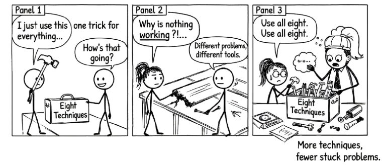

# Eight Techniques for Deeper Thinking {#sec-techniques}

{fig-alt="Comic strip: A stick figure uses one trick for everything and nothing works. Another has a full toolbox of eight techniques. Punchline: Different problems, different tools. Use all eight."}

You now have the mindset. You know AI works best as a thinking partner, not an answer machine. You know to do your own thinking first, then bring AI into the conversation.

But what does that conversation actually look like?

This chapter gives you eight concrete techniques. Each one structures the conversation differently, pushing your thinking in a specific direction. They are not the only techniques that exist. But they cover most of the situations where people get stuck: scoping a problem, weighing options, reasoning through complexity, preparing for difficult interactions, stress-testing ideas, checking your own understanding, getting multiple perspectives, and finding blind spots.

For each technique, you will find a short explanation of what it does, when to reach for it, and a ready-to-use prompt you can adapt to your own situation.

Pick the one that fits. Modify it. Make it yours.

> The right technique is not the cleverest one. It is the one that matches the kind of thinking you need to do right now.


## 1. Reverse Prompting

**What it does.** Instead of asking AI for answers, you ask AI to ask *you* questions. This forces you to articulate things you have not thought through yet. The AI's questions surface assumptions, gaps, and considerations you would otherwise miss. It works because a good question is often more valuable than a quick answer.

**When to use it.** You are starting a new project, scoping a problem, or planning something complex and you know you have not thought of everything yet.

::: {.callout-note title="Try this prompt"}
```
I'm planning [describe your project, decision, or problem].

Your task: Ask me a series of short-answer questions to help me
clarify all the requirements, considerations, and potential pitfalls.

Ask one question at a time. Wait for my response before asking the
next question. Continue until you've helped me think through at
least 10 different aspects of this.

Begin with your first question.
```
:::

The key is to answer honestly, especially when a question catches you off guard. That discomfort is the technique working. If the AI asks something you cannot answer, that is a gap in your thinking you just discovered.

After the questioning round, try this follow-up: "Based on my answers, what is the single biggest gap in my thinking?"

Reverse Prompting works best at the start of something, when the shape of the problem is still forming. But once you have a clearer picture and need to choose a direction, you need a different kind of thinking.


## 2. Pros and Cons

**What it does.** The AI systematically evaluates multiple options against specific criteria you care about. This is not about getting the "right answer" from AI. It is about generating a structured comparison that makes your own reasoning more rigorous. You bring the judgement. The AI brings the structure and breadth.

**When to use it.** You are choosing between approaches, tools, strategies, or solutions and you want to think through trade-offs methodically rather than going with your gut.

::: {.callout-note title="Try this prompt"}
```
I'm deciding between these options for [describe the decision]:

Option A: [describe]
Option B: [describe]
Option C: [describe]

For each option, provide:
1. A brief description of how it works
2. Three key advantages
3. Three key disadvantages

Evaluate each specifically in terms of:
- [Criterion 1, e.g., cost and time investment]
- [Criterion 2, e.g., long-term flexibility]
- [Criterion 3, e.g., risk if it goes wrong]

Conclude with which option you'd recommend and why, but flag
the strongest argument against your recommendation.
```
:::

Do not accept the AI's recommendation uncritically. The real value is in the structured comparison. Challenge at least one of the listed pros. Ask yourself what disadvantage the AI missed. Argue for a different option than the one AI recommended and see if your reasoning holds up.

Pros and Cons gives you a snapshot of the decision landscape. But some decisions are not about choosing between options. They are about understanding a process with many moving parts, where the sequence matters and skipping a step has consequences.


## 3. Stepwise Chain of Thought

**What it does.** The AI walks you through a complex process one step at a time, pausing after each step. This prevents you from rushing through something that requires careful, sequential thinking. Each pause gives you a chance to ask questions, raise complications, or confirm you understand before moving on.

**When to use it.** You are learning a new process, preparing for something with many sequential steps, or working through a procedure where skipping a step could cause problems.

::: {.callout-note title="Try this prompt"}
```
I need to understand the process for [describe the task or procedure].

Walk me through the entire process from start to finish. For each
step, tell me:

1. What action to take
2. What to document or record
3. What could go wrong at this stage

After you explain each step, STOP and wait for me to type "next"
before moving to the next step. Do not provide the entire process
at once.

Begin with Step 1.
```
:::

At any step, you can ask the AI to go deeper: "What if the client pushes back at this stage?" or "What happens if I skip this step?" These side conversations are where the real learning happens. You are not just memorizing a sequence. You are understanding why each step matters.

The first three techniques help you think through problems, weigh options, and understand processes. But some of the hardest challenges are not analytical. They are interpersonal. You know what you want to say, but you are not sure how the other person will respond.


## 4. Role Play

**What it does.** The AI adopts a specific persona and you practice interacting with that persona. Think of it as a flight simulator for difficult conversations. The AI can play a skeptical stakeholder, a frustrated customer, a resistant colleague, or any other person you need to prepare for. It responds dynamically to what you say, so you get realistic practice without real consequences.

**When to use it.** You have a difficult conversation coming up, you want to practice a presentation to a tough audience, or you need to rehearse handling objections.

::: {.callout-note title="Try this prompt"}
```
You are [describe the persona: e.g., a senior executive who is
skeptical of my proposal / a client who is unhappy with a delayed
deliverable / a colleague who disagrees with my approach].

Your personality: [e.g., direct and impatient / friendly but
unconvinced / emotional and defensive]

I will practice having this conversation with you. Stay in character.
If I say something vague, push back. If I handle something well,
acknowledge it briefly but keep pressing.

After we finish the conversation, break character and give me
feedback on:
- What I handled well
- What I could improve
- Any phrases or approaches that would have been more effective

Let's begin. I'll speak first.
```
:::

The feedback at the end is critical. It turns the exercise from mere practice into a structured debrief. Pay special attention to moments where the AI pushed back and you felt stuck. Those are the moments to rehearse differently.

Role Play prepares you for a specific conversation. But sometimes the challenge is not a person. It is a decision where you already have a preference and you suspect you have not fully examined the other side. That calls for a different kind of pressure.


## 5. Debating

**What it does.** You set up a structured debate where opposing positions are argued with equal force. This is powerful for decisions where you already have a preference, because it forces you to take the other side seriously. You can have AI argue both sides in a single conversation, or you can take one side yourself and let AI argue the other.

This technique combines well with using multiple AI tools. Give one model the "advocate" position and another the "skeptic" position, then shuttle arguments between them. Or keep it simple and have one AI play both roles.

**When to use it.** You are facing a decision with valid arguments on both sides and you suspect you are leaning one way without fully examining the alternative.

::: {.callout-note title="Try this prompt"}
```
I'm considering [describe the decision].

Context:
- [Key fact 1]
- [Key fact 2]
- [Key constraint]

Set up a debate between two positions:
- "The Advocate" argues for [Option A]
- "The Skeptic" argues for [Option B]

Conduct the debate in four rounds. Each speaker gets 3-4 sentences
per round. Label each speaker clearly. Make both sides as
persuasive as possible.

After the debate, tell me: which arguments should weigh most
heavily in my decision, and what additional information would I
need to be confident either way?
```
:::

Watch for arguments that surprise you. If the Skeptic raises a point you had not considered, sit with that. The purpose is not to "win" the debate, but to make sure you are not ignoring a perspective that matters.

A useful follow-up: "Now argue for a third option that synthesizes the best of both positions."

The previous five techniques help you explore, decide, learn processes, practise interactions, and stress-test positions. But sometimes the question is simpler and more personal: do I actually understand this topic as well as I think I do?


## 6. Formative Self-Testing

**What it does.** The AI generates questions that test your understanding of a topic, then gives you immediate feedback on your answers. This is not about memorizing facts. It is about discovering where your understanding is solid and where it is shakier than you thought. The act of retrieving knowledge and articulating it is one of the most effective ways to deepen your understanding.

**When to use it.** You are studying a new subject, preparing for a certification, onboarding into a new role, or just want to pressure-test how well you actually understand something you think you know.

::: {.callout-note title="Try this prompt"}
```
I'm studying [topic or subject area]. Test my understanding.

Ask me 5 questions, one at a time. Mix the difficulty:
- 2 questions testing core concepts
- 2 questions requiring application to realistic scenarios
- 1 question that requires me to evaluate or critique something

After each answer I give, tell me:
1. Whether my answer is correct, partially correct, or incorrect
2. What I got right
3. What I missed or got wrong, with a brief explanation

Wait for my answer before moving to the next question.

Start with Question 1.
```
:::

Be honest with your answers. Do not look things up first. The point is to find out what you actually know versus what you think you know. Pay close attention to the "partially correct" answers. That is where the most useful learning lives, in the gap between what you said and what you missed.

Self-testing reveals what you know and what you do not. But even when you understand a topic well, you are still seeing it from one vantage point — your own expertise, your own role, your own assumptions. Some problems need more than one perspective.


## 7. The Expert Panel

**What it does.** The AI simulates multiple experts with different backgrounds, each analysing your situation from their own perspective. A financial expert sees cost implications. A legal expert sees compliance risks. A customer experience expert sees user impact. You get multiple lenses on the same problem without needing to schedule five meetings.

**When to use it.** You are making a decision that affects multiple domains and you want to make sure you are not thinking about it from only one angle.

::: {.callout-note title="Try this prompt"}
```
I need to make a decision about [describe the situation].

Assemble a panel of 4 experts who would each have a different
perspective on this decision:
- Name each expert and describe their background
- Have each expert analyse the situation from their perspective
  (3-4 sentences each)
- Have each expert identify the one thing they think I'm most
  likely to overlook

After all four experts have spoken, provide a synthesis:
what do they agree on, where do they disagree, and what
should I investigate further?
```
:::

The synthesis at the end matters most. Look for where the experts disagree. That tension usually points to the hardest part of your decision, the part that requires your judgement, not more AI output.

For a deeper conversation, pick one panelist and say: "I want to push back on [Expert Name]'s point about [specific claim]. Have them defend their position."

The Expert Panel broadens your perspective. But there is a particular kind of blind spot that multiple perspectives alone will not catch: the risks hiding inside your own confidence. When you have a plan you feel good about, you need someone to tell you what could go wrong.


## 8. Risk Deep-Dive

**What it does.** You share a plan or decision along with the risks you have already identified, and the AI helps you find what you are missing. It looks for second-order effects, blind spots, and early warning signs. This technique is specifically designed to counter the optimism bias that affects most planning. We tend to overestimate benefits and underestimate what can go wrong.

**When to use it.** You have a plan you are fairly confident about and you want someone to stress-test it before you commit.

::: {.callout-note title="Try this prompt"}
```
I'm planning to [describe the initiative or decision].

Here are the risks I've already identified:
- [Risk 1]
- [Risk 2]
- [Risk 3]

Help me think deeper:
1. What risks am I missing or underestimating?
2. What second-order effects should I consider?
3. Which risk is most likely to be the one that actually
   derails this?
4. What early warning signs should I watch for?

Challenge my assumptions. Be specific and concrete.
```
:::

The most valuable output from this technique is usually in question 1, the risks you are missing. We all have blind spots shaped by our experience, our role, and our optimism about our own plans. The AI does not share those blind spots.

After the initial analysis, try: "If this initiative fails 6 months from now, what is the most likely cause?" This "pre-mortem" framing often surfaces risks that a forward-looking analysis misses.


## Combining Techniques

These eight techniques are not isolated tools. They combine naturally as a problem evolves.

You might start with **Reverse Prompting** to scope a new initiative, use **Pros and Cons** to evaluate your options, run a **Debate** to stress-test your preferred choice, convene an **Expert Panel** to check for blind spots across domains, and finish with a **Risk Deep-Dive** before committing.

Or you might use **Role Play** to prepare for a presentation, then **Formative Self-Testing** to make sure you can handle technical questions from the audience.

The point is not to use all eight on every problem. The point is to have them available so you can reach for the right one when you need it.

::: {.callout-tip title="Start simple"}
You do not need to master all eight techniques. Pick the one that fits your current problem. Try it once. Modify the prompt. Try it again. Skill comes from repetition, not from reading.
:::

Start with whichever technique matches the kind of thinking you need to do right now. Try it once. Modify the prompt. Try it again. These are conversation starters, not scripts.
