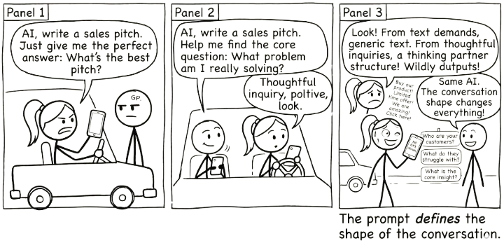
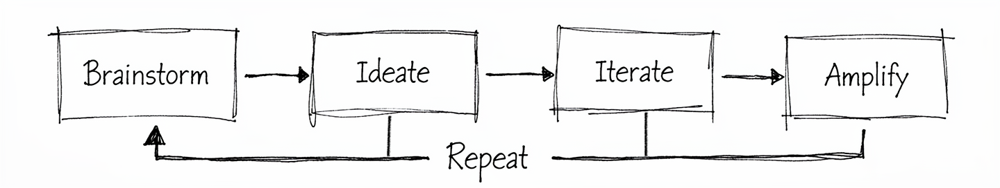

# The Conversation Loop {#sec-conversation-loop}

{fig-alt="Comic strip: One stick figure demands 'give me the perfect answer' and gets generic text. Another asks 'help me find the core question' and gets thoughtful, specific output. Same AI. The conversation shape changes everything."}

> Keep the question, the correction, and the evidence visible.

AI Last gave you a starting point: the purpose, a first attempt where useful, and a sticking point. The conversation loop describes what to do with the help that follows. It does not promise that talking longer will make you wiser or that every task needs all four stages.

{#fig-conversation-loop fig-alt="Four stages: Brainstorm, Ideate, Iterate, Amplify. A feedback arrow allows a return to an earlier stage when needed."}

The labels are this book's organising vocabulary. Their value is whether they help you improve and check a real piece of work.

## Brainstorm: define your question

Begin with the purpose rather than only your attempted fix. “How do I make this spreadsheet sort by colour?” may conceal a more useful question: “How can my team see which tasks are overdue?”

A model may suggest another framing, but it cannot be relied on to discover a purpose you have not supplied. Write what the work is for, who will use it, and what constraint makes the obvious answer inadequate.

An uncertain starting point is acceptable. “I need to fit a community workshop into a short room booking, but I have not checked the capacity” exposes something useful to investigate. It does not pretend the problem is already solved.

## Ideate: explore possibilities

Ask for alternatives when you need them. For the workshop, these might be smaller groups, shorter sessions, or a different booking. Keep them as proposals until you check them against the actual constraints.

More alternatives are not necessarily better. Two meaningfully different options can be more useful than ten variations on an impossible plan. If an option assumes a different budget or permission, label that dependency.

Your contribution is to notice which alternatives deserve investigation and which do not fit. You may find that the first feasible option is sufficient; novelty is not a requirement.

## Iterate: identify the defect

A useful correction names a problem:

> “That plan assumes we have six months. We have six weeks.”
>
> “You counted participants but omitted the facilitators from the room limit.”
>
> “The source says to check telemetry; it does not confirm congestion.”

A correction can improve the next response, but it may also introduce an error. Compare the revision against the original brief and the supporting evidence. Do not substitute repeated reassurance for checking.

Use VET, introduced after Staying Critical, when a consequential claim needs verification, your own explanation, and a relevant test. You do not need to learn the whole framework before beginning; for now, identify what would make the proposed answer fail.

## Amplify: produce an owned result

Select, edit, and integrate the useful material. Keep the qualifications that matter, even when removing them would make the result sound more decisive.

Ownership is not a question of whether the prose sounds human. It means you can explain the important choices, identify the supporting evidence, and say what remains unresolved. Another person's approval may still be needed before the result is used.

For the workshop, the final note should contain the checked group sizes and timetable. It should not invent confirmation of an arrival arrangement that no organiser has approved.

## Repeat—or stop

Return to an earlier stage when a check reveals a problem. A missing source may send you back to investigation; an impossible constraint may require a different option or a smaller scope.

Set a completion test. Stop when the agreed task is satisfied and consequential checks are complete, or when further progress requires evidence, permission, or expertise you do not have. “The AI has more suggestions” is not a reason to continue indefinitely.

Keep a short record of the change that mattered. This makes progress visible without requiring a transcript of every exchange.

## Choose support you can evaluate

The method does not require the most expensive account. The printed examples and independent activities work without any model. If you use one, choose an approved tool suitable for the task and your access needs.

Do not infer that a smaller model is educationally better because it makes more mistakes. Correcting errors can involve useful practice, but it can also consume time or teach a false idea that the reader cannot detect. A fluent, capable model still needs checking.

The same caution applies to scaffolding. Supply the constraints and evidence the task needs, then test the result. @sec-rtcf provides a briefing checklist; local versus hosted is not a reliable rule for deciding how much detail to provide.

## Check the handover, not just the final draft

In an unchecked sequence, an early error can become a later assumption. Suppose a planning step omits facilitators from capacity, the next step chooses group sizes from that number, and the final step drafts an invitation. Polishing the invitation does not repair the capacity error.

Place a check where the dependency is introduced. Recheck any downstream result affected by a correction. This is how conversation and chaining can work together: chaining organises the stages, while explicit checks determine what may pass between them.

A person participating at every stage can still miss an error. The safeguard is the quality of the evidence and test, not the number of human acknowledgements.

### The two-chat workflow {#sec-two-chat-workflow}

For a messy task, you may find it useful to separate exploration from production.

**Thinking session:** examine the purpose, alternatives, constraints, and uncertainties. Keep the decisions and relevant source references.

**Build session:** supply a concise brief describing the selected approach, evidence, required output, and acceptance checks. Exclude discarded assumptions unless they explain an important limit.

The handover can be a note you write yourself. For example:

> Plan two seed-workshop groups within the supplied venue rules. Capacity includes both facilitators. Preserve the reset time and budget calculation. Arrival arrangements are still unconfirmed; do not draft an approved invitation.

Before sending that brief, compare it with the original sources. Summarising can lose a qualification as easily as copying a whole conversation can bury it. A new chat does not make the content verified.

Separate sessions are optional. A short task may need only one exchange, and some applications support explicit stages in one workspace. The useful element is a controlled handover, not the number of chat windows.

## Read the explanation and inspect the artefact

A task summary can reveal that the model is solving the wrong problem. Read it, but also examine the actual result. Either can contradict the other.

If an explanation says the plan fits ninety minutes, add the durations. If it says every claim has a source, open the passages. An explanation is an output to test, not direct access to internal reasoning.

For a newcomer, ask for a smaller example or an unfamiliar term to be explained. Then apply the explanation to a changed example. If you cannot evaluate a consequential answer, seek suitable expertise rather than accepting a more elaborate explanation.

## Familiar practices, adapted carefully

Several useful habits already have counterparts outside AI work:

| Familiar practice | Use in this workflow |
|---|---|
| A written brief | State purpose, constraints, and expected result |
| Worked examples | Show the kind of response needed and its limits |
| Milestones | Separate dependent stages and check the handovers |
| A rubric | Set observable acceptance criteria before reviewing |
| Checking calculations | Recompute from the supplied inputs |
| A follow-up question | Test whether a claim survives a changed assumption |

These are practical analogies. They do not establish that human learning and model inference have the same mechanism. Research on particular prompting methods can inform experiments, but a model's self-critique is not an independent source. See @sec-further-reading for the evidence and its scope.

## Guided practice: find the changed assumption

**Time:** 15 minutes. **Input:** a fictional requirement: “The room holds twelve people, including two facilitators.” A draft plan says: “Invite twelve participants.”

Write the smallest useful correction. Then check this revision: “Invite ten participants and ask one facilitator to work outside.” Does it preserve the requirement that both facilitators take part in the room? What further source or clarification is needed?

For the complete workshop case, the volunteer agreement explicitly requires two facilitators for each session. Ten participants with both facilitators fits; moving a facilitator outside is not an authorised repair. Without that agreement, the original short requirement alone leaves part of the staffing arrangement unspecified.

**Artefact:** the original claim, your correction, and a note separating supplied facts from assumptions. **Success:** count everyone in the room, avoid silently changing the task, and name the missing information. This practice needs no AI account.

The full case in @sec-across-disciplines carries these checks through timing, cost, and a final communication. Keep your own learning record in the same form: what changed, why, and what evidence supports it.

## Take it to the AI

**Where to start.** Three questions worth arguing about rather than looking up:

1. Take a prompt you wrote recently and ask the AI whether it describes your *problem* or your *attempted fix*. Check whether the restatement preserves your actual purpose.
2. Run the same question through a frontier model and a small local one. Keep the task and criteria fixed. Compare useful contributions, failures, and checking effort; do not assume the cheaper or more difficult interaction teaches more.
3. Before it answers anything, ask it to read back what it understood your request to be. A mismatch may become visible there. Check the actual artefact too.

**Keywords to steer with.** brainstorm, ideate, iterate, amplify, repeat · problem versus attempted fix · pushback · the two-chat workflow · checked handovers · unchecked chaining · explanation and artefact · completion criteria

**A starting prompt.**

> **Role:** You are a facilitator who runs thinking sessions and never lets people jump to solutions.
>
> **Task:** Interrogate my problem statement until you are satisfied I am describing the problem rather than my attempted fix. Do not offer solutions.
>
> **Context:** I have read a chapter on the conversation loop, and on the trap of arriving with a solution disguised as a question. My problem, as I currently frame it, is [state it]. Ask one question at a time and wait for my answer.
>
> **Format:** One question per turn. When you are satisfied, restate my problem in the form you think I should have brought, and tell me exactly what changed between my version and yours.
