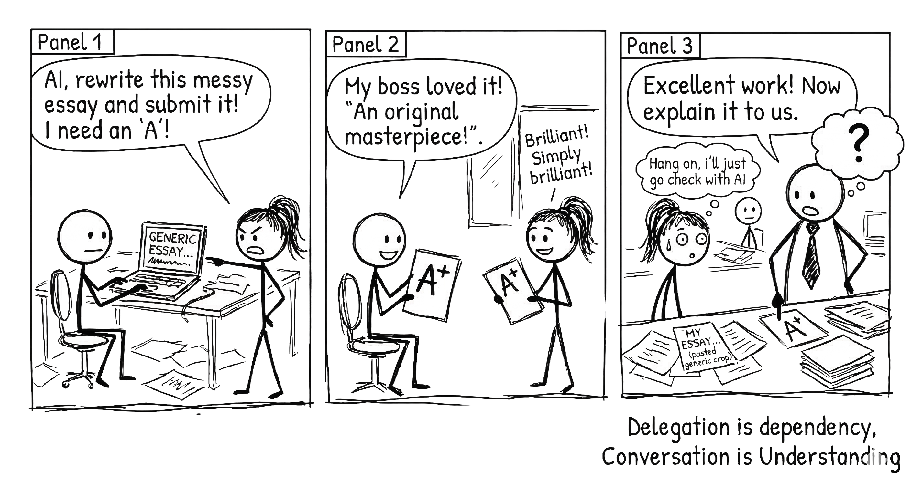

# The Delegation Trap {#sec-delegation-trap}

{fig-alt="Comic strip: A stick figure delegates an essay to AI and gets an A+. When asked to explain it, they freeze. Punchline: Delegation is dependency, conversation is understanding."}

> A single prompt gives you a single answer.
> A **conversation** gives you **understanding**.

## The result you cannot explain

Imagine taking a finished proposal into a meeting. The writing is clear, the recommendation is confident, and it took you minutes to produce. Then someone asks why you ruled out the cheaper option. You cannot answer without reopening the chat.

The problem is not that a tool helped write the proposal. It is that you accepted a decision without acquiring the understanding needed to defend it. This book calls that the **delegation trap**.

A fluent conversation can leave you in the same position. Ten follow-up prompts are no guarantee of learning. The useful distinction is what you can check, explain, and decide after the interaction.

## Two ways to ask for help

Compare these requests. Neither column guarantees a particular outcome; the second makes your reasoning more visible.

| Task | Output request | Request that invites scrutiny |
|---|---|---|
| Marketing plan | “Write a launch plan.” | “Here is my proposed audience and budget. Which assumption most threatens the plan?” |
| Reading a paper | “Summarise this paper.” | “Compare my summary with the paper. Which claim did I overstate?” |
| Community event | “Plan the workshop.” | “Check my timetable against room capacity, reset time, and budget. Mark anything you cannot establish.” |

An output request may be entirely appropriate. A summary can make a difficult document accessible or help you decide whether to read it. A generated first draft can help someone who is unsure how to start. The question is whether the chosen help serves your purpose and leaves important checks with someone able to perform them.

If your purpose is to learn, preserve opportunities to attempt, explain, and test. If your purpose is simply to reformat an already checked table, learning a new skill may not be the goal.

## Responsibility stays somewhere

A model can propose a choice, score alternatives, or execute an authorised action. That does not settle who is accountable for the result. Decide who owns the decision, what they must inspect, and when another person's expertise is needed.

In the proposal example, you might ask the tool to list the alternatives it omitted. That list is a starting point for checking, not proof that it found them all. You still need the source prices, the client's constraints, and a defensible comparison.

Avoid treating a request for “reasoning” as access to the machine's private workings. An explanation is another output. Check whether its claims and calculations support the recommendation.

The practical standard is modest: can the responsible person give a defensible account of the decision using evidence outside the model's assertion?

## Productivity and learning are different outcomes

A finished deliverable matters. So do time, accessibility, quality, and the capability you need for later work. You do not have to pretend that output is worthless to care about learning.

Keep these outcomes separate when comparing workflows:

- Did the task get completed to the required standard?
- How much time did drafting, checking, and correction actually take?
- Can you explain the important decisions?
- Can you apply the method to a new case with the support appropriate to that task?

A fast draft followed by slow repair may not save time. A slower practice session may be worthwhile when you are learning. A trusted accessibility tool may remain useful indefinitely. None of those observations makes independence from every tool a moral test.

Research does raise concerns about some kinds of reliance. It does not establish that every delegated task weakens a mental muscle or that conversation invariably improves skill. @sec-cognitive-offload separates assisted performance from subsequent learning and discusses the evidence and its limits.

## Decide what to hand over

Start with the intended use and consequences. For checkable mechanical work, delegation may be sensible: use a calculator for arithmetic, or a deterministic conversion tool for a file format when available. Check the result in proportion to the risk.

For unfamiliar or consequential work, identify the missing knowledge before accepting an answer. Conversation can help you frame questions for a qualified person; it cannot manufacture that person's approval. Some tasks should stay out of an unapproved AI service entirely.

The decision map in @sec-quick-reference brings these choices together. For now, name one check that would catch a plausible failure in your current task.

::: {.callout-tip title="Try this (2 minutes)"}
Take a recent output and mark one claim you could independently verify. Find its supporting source or calculation. If you cannot, record the gap rather than asking the model to reassure you.
:::

## Begin a learning record

Choose an ordinary task you will carry through the book. Write its purpose, what you already think, and what would count as a useful result. Keep the first attempt; it gives you something concrete to compare with the final work.

You can use the community workshop in @sec-across-disciplines if you do not have a suitable task. Its printed constraints and deliberately flawed draft let you practise without an AI account.

The aim is an owned result: useful work whose important claims you can check and whose decisions you can explain. The following chapters give you ways to build that habit.

## Take it to the AI

**Where to start.** Three questions worth arguing about rather than looking up:

1. Take a task you handed to AI this week and ask what you would have learned by doing it yourself. Then decide whether the trade was worth it. Sometimes it was.
2. Ask it to rewrite three of your delegation-shaped prompts as conversation-shaped ones. The pattern usually becomes visible by the second.
3. Ask where the line falls between mechanical delegation, which is fine, and delegating judgement, which is the trap, using examples from your actual job rather than generic ones.

**Keywords to steer with.** delegation versus conversation mindset · judgement · agency · process over product · output volume · cognitive offload · the delegation test · mechanical versus expert tasks

**A starting prompt.**

> **Role:** You are a learning adviser helping me choose appropriate support and checks.
>
> **Task:** Sort the tasks I list into three piles: safe to delegate, worth conversing about, and the ones I should be doing entirely alone.
>
> **Context:** I have read a chapter arguing that mechanical delegation is fine and delegating judgement is the trap, and that the test is whether a task requires my expertise. Here is what I handed to AI in the last week: [list it]. My role is [describe it].
>
> **Format:** Three lists, one line of reasoning against each item. Then identify one task worth practising independently and one where delegation may have been appropriate. Mark assumptions instead of diagnosing skill loss.
