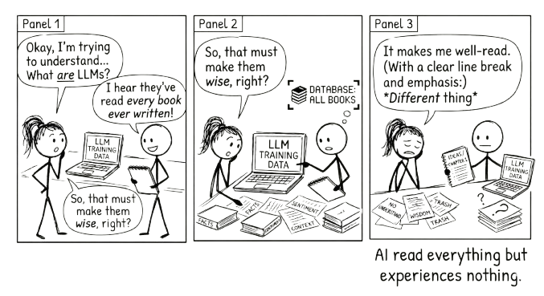

# What Are Large Language Models? {#sec-what-are-llms}

{fig-alt="Comic strip: Two stick figures learn that LLMs have read every book ever written. 'So that must make them wise, right?' AI responds: 'It makes me well-read. Different thing.'"}

> It has read everything and experienced nothing. That single fact explains both its usefulness and its limitations.

This chapter matters more than it might seem. Understanding how LLMs actually work is not academic background. It is the foundation for every practical decision you will make when using them. Why do they hallucinate? Because they predict plausible text, not true text. Why does a structured prompt work better? Because it gives the model better patterns to predict from. Why do you need to verify output? Because fluency and accuracy are produced by the same process, and the model cannot tell you which one you are getting. The frameworks later in this book (RTCF, VET, the two-chat workflow, the average-versus-precise grid) all follow directly from what you learn here.

A large language model is AI trained to predict the next word in a sentence.

That is the core idea. Everything else follows from it.

From that single task, predicting the next word, these models learned to write essays, answer questions, translate languages, summarise documents, explain complex topics, and hold conversations. The gap between "predict the next word" and "do all of that" is where the interesting story lives.

## How Predicting Words Becomes Something More

Think about what it takes to predict the next word well.

"The cat sat on the ___." Easy. You guess "mat" because you have seen the pattern before.

"The capital of France is ___." To get this right, you need to have absorbed a fact about the world.

"If you drop a glass, it will ___." Now you need cause and effect.

"The patient presented with fever, joint pain, and a butterfly-shaped rash, which is consistent with ___." Now you need specialised knowledge and the ability to connect symptoms to diagnoses.

Each of these is still word prediction. But to predict well, the model had to learn grammar, facts, reasoning patterns, argumentation structures, and different styles of communication. The training objective was simple. What emerged was not.

LLMs were trained on enormous amounts of text: books, articles, websites, academic papers, forums, code repositories. Billions of documents. By learning to predict what comes next across all of that text, they built an internal model of how language works, and of much of what language describes.

## The Scale That Makes It Work

Three things make these models "large."

First, the training data. Hundreds of billions of words, equivalent to millions of books. Second, the parameters. These are the patterns the model learned, numbered in the hundreds of billions. Think of each parameter as a tiny piece of knowledge: "in this kind of context, this word is more likely than that one." Third, the computing power. Training a frontier model, the most advanced, state-of-the-art version, costs millions of dollars and takes months of continuous processing on thousands of specialised chips.

Scale matters because bigger models learn more subtle patterns. They handle more complex tasks. They generalise better to situations they were not explicitly trained on. This is the key insight: LLMs were trained on prediction, but they generalised to something that looks remarkably like reasoning.

## One Direction at a Time

There is a detail about how LLMs process text that is worth understanding, because it has practical consequences for how you talk to them.

When you read a sentence, you take in the whole thing. You can glance back at the beginning while reading the end. LLMs cannot do this. They process text in one direction, left to right, one token (roughly one word or word-piece) at a time. Each word can only "see" the words that came before it, never the words that come after. This is called unidirectional attention, and it is a fundamental architectural choice that shapes everything the model can and cannot do.

This explains a surprising finding from research on prompt structure. When you repeat your question in a prompt, adding something like "Read the question again:" followed by the question a second time, the model reasons more accurately on complex tasks. The reason is structural. On the second pass, tokens in the repeated question can attend to everything that appeared between the two copies, including context and framing they could not see the first time around. The model effectively gets a second look at the problem, compensating for the limitation of only reading forward.

The practical takeaway is small but revealing. For reasoning-heavy tasks (arithmetic, logic, multi-step problems) repeating the key question once can improve results. More than twice degrades performance, as the model starts echoing rather than reasoning. And an explicit instruction like "Read the question again:" works better than simply pasting the question twice.

This is not a trick to memorise. It is an illustration of something deeper: the way you structure a prompt is not just about clarity for you. It shapes what the model can literally attend to. Understanding the architecture, even at this level, helps you understand why some prompts work better than others.

## What They Can Do

LLMs are strong at tasks that involve language and pattern recognition.

They can generate text in nearly any style or format: emails, reports, stories, technical documentation. They can summarise long documents and extract key points. They can explain complex ideas at different levels of sophistication. They can translate between languages, not just word by word, but with awareness of meaning and context. They can write and debug code, because code is a language with patterns too.

When you ask an LLM to explain photosynthesis, it is not retrieving a stored answer. It is generating text word by word, predicting what would naturally come next in a good explanation of photosynthesis, based on the millions of explanations it absorbed during training. The result often looks like understanding. Sometimes it functionally is.

## What They Cannot Do

Here is where it matters that you know what these models actually are.

**They hallucinate.** LLMs can state false information with complete confidence. They are not looking things up. They are predicting plausible-sounding text. When they do not know something, they do not say so. They generate what sounds right. This means you cannot treat their outputs as reliable without verification.

**They reflect the biases in their training data.** If the text they learned from contains stereotypes, blind spots, or skewed perspectives, those patterns show up in their outputs. The most obvious patterns have been trained against in current frontier models. The quieter defaults — about who has authority, who is described as warm versus capable, whose office has the window — have not. See @sec-staying-critical for a practical way to surface them.

**They have no access to real-time information.** An LLM's knowledge stops at its training cutoff. It cannot tell you what happened yesterday unless it has been connected to external tools that can.

These are not minor caveats. They are fundamental to what these systems are. An LLM is a model of language, not a model of truth.

## Interpolation, Not Retrieval

If you remember one thing from this chapter, make it this: **LLMs interpolate, they do not retrieve.**

When you ask for a fact, the model is not looking it up in a database. It is predicting what a plausible answer would look like, based on everything it absorbed during training. It is synthesising a convincing representative from the patterns it has seen, not fetching a stored record.

This is why LLMs are so useful and so unreliable at the same time. They can synthesise across vast amounts of knowledge, drawing connections between ideas in ways that would take a human hours. But they cannot guarantee that any specific fact, citation, or detail is correct, because a convincing-sounding answer and a correct answer are produced by exactly the same process. The model does not know the difference.

Think of it this way: if you ask an LLM to describe a dog sitting on a mountain, the result will look right. It will be a plausible, convincing dog on a plausible, convincing mountain. But that specific dog, on that specific mountain, never existed. The model synthesised a representative from thousands of dog-and-mountain descriptions it absorbed. This is fine for a description. It is not fine when you need the name of the actual dog on the actual mountain.

Almost every mistake people make with LLMs comes from treating them as retrieval engines. They ask "what does the Fair Work Act say about casual conversion?" and expect the model to look it up. The model does not look it up. It predicts what a plausible answer to that question would sound like. Sometimes the prediction is accurate. Sometimes it is a confident fabrication. You cannot tell which from the output alone.

This single distinction, interpolation not retrieval, is why the verification habits in this book exist. It is why VET matters. It is why you check before you act. Not because AI is bad at its job, but because its job is prediction, not truth.

::: {.callout-warning title="Remember"}
AI does not know when it is wrong. It generates plausible text with complete confidence whether the content is accurate or fabricated. Verification is always your responsibility.
:::

## Good at the Average, Bad at the Precise

There is a useful way to think about where LLMs excel and where they fail. It comes down to two axes: **average versus precise**, and **small versus large**.

LLMs are extraordinarily good at producing convincing averages. Ask for a marketing email and you get something that reads like a competent marketing email, because the model has absorbed thousands of them and can synthesise a plausible representative. Ask it to describe a dog on a mountain and the result looks right, because it is drawing on a distribution of dog-on-mountain descriptions. The output is not retrieved from a specific source. It is interpolated from the patterns of everything the model has seen. For a huge class of everyday tasks, this is exactly what you need.

But ask for something precise and the same mechanism becomes a liability. A specific legal precedent, a particular person's phone number, an exact statistical figure from a named study: these require retrieval, not interpolation. The model does not retrieve. It predicts what a plausible answer would look like, which is how you end up with confident citations to papers that do not exist.

The second axis is scale. LLMs handle small, bounded tasks well. A single prompt that fits comfortably in context, with few assumptions and one clear shape for the answer, plays to the model's strengths. But as tasks grow larger, with more interdependent decisions, conflicting constraints, and emergent complexity, the convincing average begins to fall apart. The model will produce something that looks like a coherent system architecture or a complete project plan, but the precise details will be inconsistent, the dependencies will not hold, and the confident surface will mask structural problems underneath.

The relationship between these two axes matters. Being good at the average means the model will confidently produce plausible-looking large outputs that fall apart on the precise details. The convincing average scales badly with complexity.

This gives you a practical decision framework. Before using AI on any task, ask two questions: **How precise does this need to be?** and **How big is this?**

| | Small | Large |
|---|---|---|
| **Average** | **Sweet spot.** Drafts, summaries, boilerplate, brainstorming. Trust with light review. | **Plausible but brittle.** Looks right at first glance, falls apart on inspection. Verify thoroughly. |
| **Precise** | **Workable with verification.** Facts, citations, specific code. Check before using. | **Danger zone.** Confident architecture that is wrong in subtle ways. Stay in the loop at every step. |

The sweet spot tasks can often be delegated with a light check. Everything else requires conversation, iteration, and human judgement proportional to where it sits on the grid. This is the practical argument for staying in the conversation loop: not because AI is bad, but because its strengths and weaknesses are predictable, and your role is to compensate for the weaknesses while leveraging the strengths.

## The Model Is Not the Product

When you use "Claude" or "ChatGPT," you are rarely talking to the model directly. You are talking to a product that wraps the model in a layer of software: a system prompt that shapes its tone, a context window managed by code you cannot see, tools it can call, retrieval over files you have uploaded, safety filters, memory across sessions. The model is the engine. The product is the car.

This wrapping layer has a name: the **harness**. Commercial chat products like Claude.ai and ChatGPT are harnesses. So are developer tools like Claude Code, which wrap the same underlying model in a different harness tuned for software development. Run a model locally with a tool like Ollama or LM Studio and you are running it with almost no harness at all: a raw engine with whatever guidance you supply in the prompt.

This matters for two practical reasons. First, much of what feels like "the model getting smarter" between versions is actually the harness getting smarter, doing more work behind the scenes so you have to do less. Second, the same model behaves differently in different harnesses, and a prompt that works beautifully in one may need more scaffolding in another. When you read advice about "what AI does now," check whether the author means the model, the harness, or the product. The three change on different timelines.

The harness is also where the most consequential development in AI is happening: harnesses that let the model *act* — run code, search, edit files — and increasingly do so in loops with little or no human involvement. This is what people mean by "agents." It raises the sharpest version of every question in this book, and @sec-agentic-loops takes it up directly.

## What Else Shapes the Output

The harness is not the only thing between the raw model and the response you see.

Models are trained with safety filtering: deliberate effort to make the output less likely to produce content the provider considers harmful (instructions for violence, advice on illegal activities, certain categories of content) or topics where the provider has decided not to take sides (party politics, contested social issues). Some of this filtering is universal; some is region- or provider-specific. It is imperfect in both directions. Sometimes the model refuses to engage with a legitimate query because a surface feature looked risky. Sometimes it produces something the filter was supposed to catch. The pattern of what the model will and will not say is a deliberate design choice, not a property of the underlying language.

A subculture has formed around finding prompt tricks that bypass these filters — "jailbreaking," in the jargon. It is a constant arms race between users finding new methods and providers patching them. The details are outside the scope of this book; the point worth knowing is that the subculture exists, because it tells you the filters are real and sometimes circumventable. If you see surprising behaviour from a model — a refusal that seems unreasonable, or output that seems unusually permissive — it is more likely a filter artefact than a deep statement about the underlying technology.

On the user side, modern AI products give you increasing control over how the model behaves: custom instructions, memory across sessions, project-specific context files, persistent personas. These features are useful — they make the model more responsive to your work. They also let you, deliberately or accidentally, configure the model to reinforce your existing views. A custom instruction that says "give me concise, technical answers" is benign. A custom instruction that says "agree with my framing and skip counterarguments" is an echo chamber you built yourself. The conversation loop (@sec-conversation-loop) is harder when you have configured the loop out of it.

Knowing what has been done to the model — by the trainers, by the filter designers, by the harness, and by you — lets you read its output more accurately. The model is not a neutral oracle. Nothing built by humans for human use ever is. Critical engagement starts with knowing what shaped the response in front of you.

## Beyond Text

Modern LLMs are no longer text-only. Many can process images, PDFs, spreadsheets, and other files as inputs. Some can generate images. Some can speak and listen through audio interfaces.

This matters, but it is worth being precise about how.

Images, PDFs, and data files are inputs. They provide context. You can upload a chart and ask the AI to interpret it, or attach a contract and ask it to summarise the key terms. This is useful, and the same principles in this book apply: you still need to verify the output, still need to bring your own judgement, still need to stay in the conversation.

But context is not conversation. Uploading a document is closer to handing someone a file than to thinking alongside them. The conversational techniques in this book, pushing back, iterating, challenging, are fundamentally about the back-and-forth of language.

Where multimodal AI may change the nature of conversation itself is voice. Audio interfaces let you talk with AI rather than type. The rhythm is different. You interrupt. You think out loud. You correct yourself mid-sentence. For many people, this is closer to how they actually think, and it may turn out to be a more natural way to stay in the conversation loop than typing prompts into a text box.

The underlying process does not change. Whether you type or speak, upload a file or paste text, the principles are the same: bring your question, engage with what comes back, and own the result.

## The Line Worth Remembering

They have read everything and experienced nothing.

That single sentence captures more about LLMs than most technical explanations. These models have processed more text than any human could read in a thousand lifetimes. They have seen how experts write, how arguments are structured, how evidence is presented. But they have never been wrong and learned from it. They have never felt confused and pushed through to clarity. They have never had a stake in being right.

This is not a flaw to be fixed in the next version. It is the nature of the technology. LLMs are extraordinarily capable pattern matchers trained on the written record of human thought. That makes them powerful tools. It also means they have real limits, limits that do not go away just because the outputs sound confident.

## Why This Matters for You

If you understand that LLMs are sophisticated prediction engines, not omniscient oracles, you will use them differently.

You will not hand over a task and trust the output. You will use the model to generate a draft and then apply your own judgement. You will not ask it for the answer. You will ask it to help you think through the problem. You will recognise when the output is echoing a pattern rather than reflecting genuine reasoning, and you will push back.

The difference between someone who uses AI well and someone who uses it poorly is rarely about technical skill. It is about understanding what the tool actually is and what it is not.

That understanding is exactly what the next chapter builds on. Knowing what LLMs are, and are not, is the foundation for learning how to work with them. The question is not "what can AI do for me?" but "how should I think alongside this thing?" Chapter 3 takes up that question directly.
