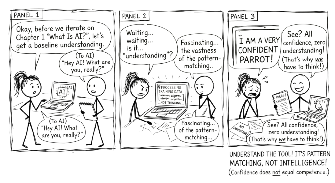

# What Is AI? {#sec-what-is-ai}

{fig-alt="Comic strip: Two stick figures ask AI what it is. AI responds 'I am a very confident parrot.' Punchline: Confidence does not equal competence."}

Artificial intelligence is software that can perform tasks that typically require human intelligence.

That is it. No magic. No consciousness. Just software that can do things that used to require a human brain.

> The gap between what AI appears to do and what it actually does is where good usage begins.

When we say "intelligence" here, we mean specific capabilities: recognising patterns in images, making predictions from data, understanding language, generating text. AI does not "think" the way you do. It processes data using mathematical patterns. But the results can look remarkably intelligent, and that gap between appearance and reality is worth understanding from the start.

## Why Now?

AI is not new. The term was coined in 1956. Researchers have been working on it for decades. So why is it suddenly everywhere?

Three things converged.

### We have massive amounts of data

Every click, purchase, photo, and search creates data. Organisations now have billions of examples to learn from. Netflix has billions of viewing decisions. Wikipedia has millions of articles. The entire public web has been scraped, indexed, and fed into training pipelines. The raw material for AI to learn from went from scarce to effectively unlimited.

### Computing power got cheap and fast

What took a supercomputer in 2000 now runs on a phone. Cloud computing made massive processing power available to anyone with a credit card. Training an AI model that would have cost millions a decade ago now costs a fraction of that. The hardware barrier dropped.

### Better algorithms were discovered

New mathematical techniques, particularly a family called "deep learning," dramatically improved what AI could do with data and compute. Researchers figured out how to stack layers of pattern recognition so that each layer builds on the one below it. The result was AI that could handle far more complex tasks than previous approaches allowed.

**These three forces fed each other.** More data made better algorithms worthwhile. Cheaper compute made bigger models practical. Better algorithms made use of both. The result is that AI which was science fiction ten years ago is now practical, affordable, and widely deployed.

## The AI Family Tree

AI is not one thing. It is a family of technologies, each suited to different problems.

**Rule-based systems** are the oldest approach. Programmers write explicit rules: if this condition, then that action. These work well for clear, logical decisions that do not change much. Tax software and simple chatbots use this approach. The limitation is obvious: someone has to anticipate every scenario in advance.

**Machine learning** flips the process. Instead of writing rules, you show the system thousands of examples and let it figure out the patterns. Show it ten thousand photos labelled "cat" and ten thousand labelled "not cat," and it learns to tell the difference. This works well for pattern recognition, predictions, and problems where the rules are too complex to write by hand. The catch is that it needs lots of good examples and it is only as good as the data you give it.

**Deep learning** extends machine learning with multiple layers of pattern recognition, loosely inspired by how neurons work. The first layer might detect edges in an image. The second combines edges into shapes. The third combines shapes into objects. The fourth recognises that the object is a golden retriever. This layered approach handles very complex tasks: understanding speech, translating languages, driving cars, and generating text.

**Large language models** are the most recent breakthrough, and the focus of this book. They are covered in depth in the next chapter.

Each of these approaches builds on the one before it. Rule-based systems gave way to machine learning, which gave way to deep learning, which produced large language models. The progression is toward systems that need less hand-coding and can handle more ambiguity.

## What AI Can and Cannot Do

AI is strong where humans are slow and slow where humans are fast.

**AI handles well:**

- Repetitive pattern recognition across large volumes of data
- Processing and summarising massive amounts of information
- Tasks with clear success metrics and well-defined inputs
- Narrow, specific problems: classify this, translate that, predict the next value

**AI struggles with:**

- Common sense reasoning that any five-year-old can do
- Truly novel situations it has never seen in training data
- Explaining why it reached a particular conclusion
- Ethical judgement, social context, and nuance
- Genuine creativity, the kind that comes from lived experience and original insight

This asymmetry matters. AI is not a replacement for human thinking. It is a tool that is extraordinarily capable in some domains and brittle in others. The people who use it well are the ones who understand where that line falls.

## Hype Versus Reality

You will hear that AI will replace all jobs, that it is smarter than humans, that it can solve any problem. None of this is accurate.

AI automates tasks, not jobs. Most jobs are bundles of tasks. Some of those tasks get automated. New tasks emerge. The radiologist still reads the scan, but AI flags the areas worth examining. The writer still shapes the argument, but AI helps with research and drafts.

AI is narrow, not general. An AI that writes well cannot drive a car. An AI that plays chess at a superhuman level cannot recognise a face. Each system is trained for a specific kind of work.

AI is a tool, not a strategy. Saying "we need an AI strategy" is like saying "we need a spreadsheet strategy." The real question is always: what problem are you solving? AI is one way to solve it.

And AI reflects its training data. If that data contains biases, the AI learns those biases. It is not objective. It is a mirror of the information it was trained on, with all the distortions that implies.

::: {.callout-tip title="Key insight"}
AI automates tasks, not jobs. It is one tool among many. Start with the problem, not the technology.
:::

## The Practical Framing

Here is the most useful way to think about AI as you read this book: it is a capable but literal collaborator.

Capable, because it can process information, generate text, spot patterns, and respond to instructions at a speed and scale no human can match. Literal, because it does exactly what the patterns in its training suggest, not what you meant, not what would be wise, not what the situation actually calls for.

This means the quality of what you get from AI depends almost entirely on how you work with it. Give it a vague instruction, and you get a generic response. Work with it through a structured conversation, and you get something genuinely useful.

That is what this book is about. Not how to get AI to do your work, but how to think better with AI as a partner.

The most transformative AI technology today is the large language model. That is what the next chapter is about.
