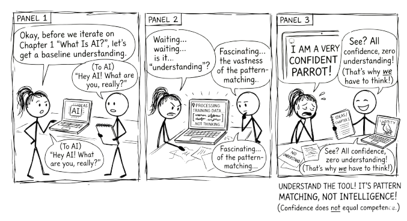

# What Is AI? {#sec-what-is-ai}

{fig-alt="Comic strip: Two stick figures ask AI what it is. AI responds 'I am a very confident parrot.' Punchline: Confidence does not equal competence."}

> The gap between what AI appears to do and what it actually does is where good decisions begin.

You might be wondering why this book pauses after the opening problem to explain what AI is. The reason is practical: every framework in this book, every technique for prompting, verifying, and staying critical, exists because of something specific about how these tools work. If you understand the mechanics, even at a high level, the techniques stop feeling like arbitrary rules and start feeling obvious. You will know *why* you need to verify AI output, not just that you should.

Artificial intelligence is software that can perform tasks that typically require human intelligence.

That is it. No magic. No consciousness. Just software that can do things that used to require a human brain.

When we say "intelligence" here, we mean specific capabilities: recognising patterns in images, making predictions from data, understanding language, generating text. AI does not "think" the way you do. It processes data using mathematical patterns. But the results can look remarkably intelligent, and that gap between appearance and reality is worth understanding from the start.

## Why Now?

AI is not new. The 1956 Dartmouth workshop was an early milestone. Researchers have been working on it for decades. So why is it suddenly everywhere?

Three things converged.

### We have massive amounts of data

Every click, purchase, photo, and search creates data. Organisations now have billions of examples to learn from. Netflix has billions of viewing decisions. Wikipedia has millions of articles. Large collections have enabled new training approaches, but access, quality, permissions, and representation still constrain useful data.

### Computing power got cheap and fast

Specialised hardware and shared computing infrastructure have made many kinds of training and inference more practical. Cost still depends on the model and workload; large-scale training is not equally accessible to everyone.

### Better algorithms were discovered

New mathematical techniques, particularly a family called "deep learning," dramatically improved what AI could do with data and compute. Researchers figured out how to stack layers of pattern recognition so that each layer builds on the one below it. The result was AI that could handle far more complex tasks than previous approaches allowed.

**These three forces fed each other.** More data made better algorithms worthwhile. Cheaper compute made bigger models practical. Better algorithms made use of both. The result is that AI which was science fiction ten years ago is now practical, affordable, and widely deployed.

## The AI Family Tree

AI is not one thing. It is a family of technologies, each suited to different problems.

**Rule-based systems** are the oldest approach. Programmers write explicit rules: if this condition, then that action. These work well for clear, logical decisions that do not change much. Tax software and simple chatbots use this approach. The limitation is obvious: someone has to anticipate every scenario in advance.

**Machine learning** flips the process. Instead of writing rules, you show the system thousands of examples and let it figure out the patterns. Show it ten thousand photos labelled "cat" and ten thousand labelled "not cat," and it learns to tell the difference. This works well for pattern recognition, predictions, and problems where the rules are too complex to write by hand. The catch is that it needs lots of good examples and it is only as good as the data you give it.

**Deep learning** extends machine learning with multiple layers of pattern recognition, loosely inspired by how neurons work. The first layer might detect edges in an image. The second combines edges into shapes. The third combines shapes into objects. The fourth recognises that the object is a golden retriever. This layered approach handles very complex tasks: understanding speech, translating languages, driving cars, and generating text.

**Large language models** are the branch this book focuses on. They are covered in depth in the next chapter.

These approaches coexist. Deep learning is a family within machine learning, and many language models use deep neural networks. A single application can combine explicit rules, learned models, and conventional software.

## What AI Can and Cannot Do

AI is strong where humans are slow and slow where humans are fast.

**AI handles well:**

- Repetitive pattern recognition across large volumes of data
- Processing and summarising massive amounts of information
- Tasks with clear success metrics and well-defined inputs
- Narrow, specific problems: classify this, translate that, predict the next value

**AI struggles with:**

- Inputs or conditions poorly represented in an evaluation
- Claims needing current, authoritative evidence that the system lacks
- Explanations whose faithfulness to the underlying computation is unknown
- Decisions needing contextual knowledge, value choices, or human authority

These are evaluation questions, not fixed claims that machines can never reason, generalise, or create something novel.

This asymmetry matters. AI is not a replacement for human thinking. It is a tool that is extraordinarily capable in some domains and brittle in others. The people who use it well are the ones who understand where that line falls.

## Hype Versus Reality

You will hear that AI will replace all jobs, that it is smarter than humans, that it can solve any problem. None of this is accurate.

AI can automate tasks within jobs, and this can also change or eliminate roles. New tasks may emerge, but the net outcome depends on the setting. The radiologist still reads the scan, but AI flags the areas worth examining. The writer still shapes the argument, but AI helps with research and drafts.

Some AI systems are specialised; others support many tasks and modalities. A system's name or performance on one task does not establish its suitability or permissions for another.

AI is a tool, not a strategy. Saying "we need an AI strategy" is like saying "we need a spreadsheet strategy." The real question is always: what problem are you solving? AI is one way to solve it.

And AI reflects its training data. If that data contains biases, the AI learns those biases. It is not objective. It is a mirror of the information it was trained on, with all the distortions that implies.

::: {.callout-tip title="Key insight"}
Automating tasks can also change jobs. AI is one tool among many. Start with the problem, not the technology.
:::

## The Practical Framing

Here is the most useful way to think about AI as you read this book: it is a capable but literal collaborator.

Capable, because it can process information, generate text, spot patterns, and respond to instructions at a speed and scale no human can match. Literal, because it does exactly what the patterns in its training suggest, not what you meant, not what would be wise, not what the situation actually calls for.

Clear instructions and useful context can help. Results also depend on the model, application, data, and task. A structured conversation does not guarantee a correct or useful result.

That is what this book is about. Not how to get AI to do your work, but how to think better with AI as a partner.

### A Note on AI Apps and Hidden Prompts

You will increasingly encounter AI not as a blank conversation window but embedded inside other tools: a writing assistant in your word processor, an autocomplete in your email, a copilot in your spreadsheet. These tools are convenient, and many are genuinely useful.

Their instructions and available controls vary. Some expose editable prompts or context; others offer only a few settings. Inspect what you can supply, change, and verify instead of assuming every embedded tool prevents meaningful steering.

Choose an interface suited to the task and its data constraints. Direct chat is useful for open-ended dialogue; a constrained interface may be preferable for a well-defined workflow. In either case, check the result and understand what an acceptance button will do.

Large language models are the AI technology this book is about. That is what the next chapter covers.

## Independent practice: classify a task

**Time:** 15–20 minutes. Write three tasks: sorting a supplied list, drafting an announcement, and deciding whether an organisation may share personal records. For each, name the required capability, permission, and evidence. Do not infer how a product works from its branding.

**Artefact:** a three-row task map. **Success:** distinguish a possible output from permission to act; identify a non-AI or specialist route where appropriate. No AI account is needed to complete the independent version.
